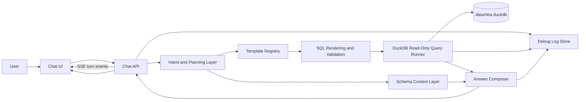

# Basketball Data Chatbot Architecture

## Status

Architecture decisions resolved through interview (see Architecture Decisions and Product Decisions So Far). The Development Plan section is intentionally deferred to a separate session; all other sections are settled.

## Goal

Build a chatbot in `chat/` that answers NBA data questions against the local DuckDB warehouse at `data/nba.duckdb`.

The bot should use the warehouse as the source of truth, query it in read-only mode, and return answers grounded in actual query results rather than in model memory.

## Current Understanding

- The chatbot is a new project under `chat/`.
- It will connect directly to the DuckDB database.
- The database must be opened read-only.
- The first interface will be a local web chat.
- The local web chat should use a separate Vite + React + TypeScript frontend app with live reload / hot module replacement so UI states can be debugged rapidly.
- The backend/frontend API shape should be hybrid REST plus Server-Sent Events: REST for sessions/history/static resources and SSE for active turn execution events.
- The model provider will be OpenRouter. The exact model will be selected after the app is built and before live testing.
- The chatbot should understand basketball questions, map them to predefined/templated query tools, execute those queries, and explain the result to the user.
- The first version should not generate arbitrary free-form SQL from user prompts.
- Day-one v1 should support the full benchmark question set in this document.
- Templates must query only existing warehouse tables. v1 should not create new derived helper tables or views.
- Templates may use trusted `src_*` / BBR-backed source tables when canonical marts do not expose a required metric.
- Result tables should appear by default for every answered query.
- Every answer should cite the tables/metrics/caveats used.
- v1 should not include charts.
- Heavy play-by-play and shot-level templates should run live against the existing warehouse.
- Visible chat history retention is separate from debug log retention.
- Visible chat history should use server-side sessions in v1; selectable past sessions are deferred to v2.
- Heavy live queries should use a 300-second timeout.
- Citations should appear both inline and in a dedicated evidence block.
- Debug logs should use 7-day rolling retention.
- v1 should include a manual "clear visible chat history" control.
- Visible chat sessions should be stored separately from debug logs under `chat/data/sessions/`.
- `chat/` should be completely isolated from existing root/web package tooling.
- Implementation language: Python.
- Agent and structured-output layer: Pydantic AI plus Pydantic models.
- LangGraph is deferred; it remains an upgrade path only if the workflow becomes complex enough to justify graph orchestration.
- Stack priority: clean long-term extensibility over fastest possible prototype.
- v1 is local-only with no authentication.
- Standard environment variables: `OPENROUTER_API_KEY`, `OPENROUTER_MODEL`, `DUCKDB_PATH`, `CHAT_LOG_DIR`.
- The UI should show collapsible SQL and a collapsible reasoning summary/execution plan. It must not expose private model chain-of-thought.
- Chat, query, and answer logs should persist to disk in an organized, readable form for observable debugging.
- The architecture is not finalized; this document should be completed through interview before development starts.

## Warehouse Facts Verified

Verified with `duckdb data/nba.duckdb -readonly`.

### Trust Metadata

- `meta_known_gap` is the authoritative register of known data gaps.
- `meta_quality_check` reports the latest build quality gates; all checked gates currently return `PASS`.
- `meta_table_fate` classifies table trust, including `canonical_source`, `derived_rebuild`, `lossless_source_only`, `legacy_do_not_use`, `duplicate_superseded`, and `empty_endpoint_shell`.
- `meta_column_lineage` records source lineage for canonical columns.
- `meta_metric_definition` defines important metrics.

### Current Known Gaps

The bot should be aware of these statuses and avoid presenting affected areas as complete when relevant:

| Gap | Status |
| --- | --- |
| `all_star_season_year_century_typo` | `resolved` |
| `app_contract_not_preserved` | `intentional` |
| `bbr_bridge_residual_unresolved_players` | `backlog` |
| `bbr_duplicate_identity_phantom_ids` | `documented` |
| `draft_duplicate_pick_number_bbr_correction` | `resolved` |
| `empty_endpoint_shells` | `documented` |
| `is_active_trusted_stale_source_flag` | `resolved` |
| `missing_1950_roy_groza` | `resolved` |
| `no_death_date_source` | `resolved` |
| `non_nba_kaggle_teams` | `expected` |
| `player_source_unresolved_reason_backfill` | `resolved_in_v1` |
| `pre_1996_team_identity_uses_current_name` | `resolved` |

### Recommended Query Surface

The chatbot should prefer curated canonical and mart tables over raw/source tables.

Primary marts:

| Table | Rows | Purpose |
| --- | ---: | --- |
| `mart_player_season` | 40,564 | Player season box and advanced summary |
| `mart_player_career` | 5,060 | Player career rollups |
| `mart_player_rolling` | 1,663,871 | Rolling 5/10/20 game player form |
| `mart_league_leaders` | 33,667 | Season leader ranks |
| `mart_shot_zones` | 187,062 | Player shot zone summaries |
| `mart_head_to_head` | 40,282 | Team-vs-team season summaries |
| `mart_draft_value` | 8,257 | Draft pick career value |
| `mart_betting_summary` | 29,592 | Betting market summary by game |
| `mart_franchise_leaders` | 31 | Franchise leader ids by stat |

Primary dimensions:

| Table | Rows | Purpose |
| --- | ---: | --- |
| `dim_player` | 6,692 | Canonical player identity and biographical fields |
| `dim_team` | 72 | Canonical team identity |
| `dim_team_era` | 90 | Era-aware team identity |
| `dim_game` | 73,348 | Canonical game identity and schedule/result fields |
| `dim_official` | 235 | Officials |
| `dim_arena` | 56 | Arenas |
| `dim_date` | 14,442 | Calendar/date helper |

Primary facts for deeper answers:

| Table | Rows | Purpose |
| --- | ---: | --- |
| `fact_player_game_box` | 1,668,606 | Player game box scores |
| `fact_player_game_advanced` | 1,557,980 | Player game advanced stats |
| `fact_team_game_box` | 147,125 | Team game box scores |
| `fact_game_result` | 73,279 | Completed game results |
| `fact_pbp_event` | 18,742,677 | Play-by-play events |
| `fact_shot` | 6,490,494 | Shot-level data |
| `fact_standings` | 1,402 | Standings |
| `fact_award` | 7,239 | Player awards |
| `fact_draft` | 8,257 | Draft records |
| `fact_coach_season` | 1,973 | Coach seasons |
| `fact_official_assignment` | 4,147 | Game officials |

### Metric Definitions

The chatbot should reuse these metric definitions when explaining answers:

| Metric | Grain | Definition | Source Priority | Notes |
| --- | --- | --- | --- | --- |
| `ast` | `player_game/player_season` | assists | BBR-resolved season facts plus BBR crosswalk fallback |  |
| `pts` | `player_game/team_game/player_season` | points scored | BBR-resolved season facts plus BBR crosswalk fallback | Use source-specific column names only in `src_*` tables. |
| `reb` | `player_game/player_season` | total rebounds | BBR-resolved season facts plus BBR crosswalk fallback | BBR pre-1974 seasons may carry TRB without ORB/DRB split. |
| `source_record_hash` | `src_row` | hash(all original columns) | source layer | Used for row-level provenance, not a stable public id. |
| `ts_pct` | `player_season` | `pts / (2 * (fga + 0.44 * fta))` | BBR-resolved season facts plus BBR crosswalk fallback | BBR/NBA calculations may differ slightly by source. |
| `win_pct` | `team_season` | `wins / NULLIF(wins + losses, 0)` | fact_standings after BBR W/L repair | Regular-season standings exclude play-in games. |

## Proposed Architecture

### Components

1. **Chat UI**
   - Separate Vite + React + TypeScript frontend app under `chat/`.
   - Uses a live-reloading development server / hot module replacement for rapid UI debugging.
   - Talks to the Python chat API over local REST endpoints and Server-Sent Events.
   - Shows a message timeline, query result summaries, default-visible result tables, and collapsible debug panels.
   - Collapsible panels:
     - SQL: the exact templated SQL executed with bound parameters.
     - Reasoning summary: a concise, user-visible explanation of the selected template, filters, caveats, and answer steps.

2. **Chat API**
   - Python backend, likely FastAPI unless later research uncovers a better local API fit.
   - Receives messages.
   - Maintains conversation state.
   - Exposes REST endpoints for sessions, history, and read-only inspection resources.
   - Exposes an SSE endpoint for active chat turns so the frontend can render planning, query, table, evidence, and final-answer events as they arrive.
   - Calls OpenRouter for natural-language parsing, clarification, and answer drafting.
   - Calls the database query layer through predefined query templates.
   - Returns answer text, query evidence, optional result tables, SQL, and reasoning summary.
   - Writes structured request, template, SQL, result, and answer artifacts to persistent logs.

3. **Intent and Planning Layer**
   - Uses Pydantic AI where useful for typed intent classification, parameter extraction, clarification decisions, and answer-shape validation.
   - Classifies the user request.
   - Decides whether the answer needs a database query.
   - Selects a predefined query template and extracts parameters.
   - If no template fits, asks a clarifying question or explains that the requested analysis is not implemented yet.

4. **Schema Context Layer**
   - Provides the model with a compact, trusted schema map.
   - Prioritizes `mart_*`, `dim_*`, and selected `fact_*` tables.
   - Includes metric definitions, known gaps, and table fate classifications.
   - Avoids exposing stale or discouraged tables by default.

5. **Template Registry**
   - Stores named query templates, parameter schemas, result schemas, and answer instructions.
   - Groups templates by analytical capability rather than by table.
   - Documents template limitations and required source tables.
   - Supports deterministic tests for each template.
   - Uses only existing warehouse tables in v1.
   - May use approved source-backed tables for metrics not available in canonical marts, especially BBR advanced and per-100 metrics.

6. **SQL Rendering and Validation Layer**
   - Renders SQL only from approved templates.
   - Validates parameter types and enum values before rendering.
   - Rejects write operations, attachment commands, unsafe pragmas, and multi-statement SQL as defense in depth.
   - Applies row limits by default.
   - Uses an allowlist of trusted tables per template.

7. **DuckDB Query Runner**
   - Opens `data/nba.duckdb` in read-only mode.
   - Executes validated SQL.
   - Converts DuckDB values into JSON-safe response payloads.
   - Captures query text, duration, columns, row count, and errors.

8. **Answer Composer**
   - Uses Pydantic response models for answer text, evidence, tables, citations, caveats, SQL, and reasoning-summary payloads.
   - Converts query results into a concise basketball answer.
   - Includes caveats from `meta_known_gap` when relevant.
   - Includes SQL and reasoning summary payloads for the collapsible UI panels.
   - Cites the tables, metric definitions, and caveats used in every answer.
   - Returns a transparent "not answerable from the current warehouse" response when existing tables cannot support an exact answer.
   - Includes the attempted template SQL and evidence query results for not-answerable responses.

9. **Observability and Debug Log Store**
   - Persists chat sessions and query execution artifacts to disk.
   - Keeps logs readable for manual debugging.
   - Captures enough detail to reproduce a response without re-running the model when possible.
   - Redacts secrets such as `OPENROUTER_API_KEY`.

### Data Flow



## Safety and Correctness Requirements

- The database connection must be read-only.
- The bot must not rely on model memory for stats that can be queried.
- The bot must not generate arbitrary SQL in v1.
- All executed SQL must come from predefined templates.
- The bot should prefer canonical and derived rebuild tables.
- The bot should avoid `legacy_do_not_use`, `duplicate_superseded`, and `empty_endpoint_shell` tables unless explaining warehouse state.
- SQL should be validated before execution.
- Default result sets should be limited.
- Answers should expose uncertainty when data gaps or unavailable tables affect the answer.
- Generated SQL and result previews should be logged for debugging.
- The UI may show a reasoning summary, but must not expose private chain-of-thought.
- v1 must not create or mutate warehouse tables, views, or files as part of query answering.
- Logs must redact OpenRouter credentials and other secrets.
- v1 should run heavy templates live rather than precomputing new helper tables.
- A not-answerable response is acceptable when backed by attempted SQL and clear evidence.

## Initial Implementation Assumptions

- Runtime: Python.
- DuckDB client: Python `duckdb`.
- Backend API: Python HTTP service, likely FastAPI.
- Frontend: Vite + React + TypeScript.
- Streaming transport: Server-Sent Events.
- API contract: hybrid REST plus SSE.
- Agent framework: Pydantic AI for typed model interaction, parameter extraction, and structured answer composition.
- LangGraph: deferred upgrade path, not a v1 dependency.
- Model provider: OpenRouter.
- Model endpoint: OpenRouter chat completions API, currently documented as `POST https://openrouter.ai/api/v1/chat/completions` and described by OpenRouter as similar to the OpenAI Chat API.
- Model id: configurable through environment, selected before live testing.
- Interface: local web chat.
- Persistence: chat/query/answer logs stored on disk.
- Deployment: local-first development.
- Authentication: none in v1; local-only.
- Project boundary: `chat/` is isolated completely and should not depend on the existing root/web package setup.

## Product Decisions So Far

| Decision | Current Choice |
| --- | --- |
| First interface | Local web chat |
| Frontend architecture | Vite + React + TypeScript with live reload / HMR |
| Streaming transport | Server-Sent Events |
| API contract | Hybrid REST plus SSE |
| Model provider | OpenRouter |
| Model selection | Deferred until after build and before live testing |
| Query approach | Predefined/templated query tools only |
| Benchmark scope | All listed benchmark questions are day-one v1 targets |
| Warehouse scope | Existing tables only; no new helper tables/views in v1 |
| Source-backed templates | Allowed when needed for metrics missing from canonical marts |
| Result table visibility | Result tables appear by default |
| SQL visibility | Show in a collapsible panel |
| Reasoning visibility | Show a collapsible reasoning summary/execution plan, not private chain-of-thought |
| Citations | Cite table names, metric definitions, and caveats in every answer |
| Charts | No charts in v1 |
| Debug persistence | Persist organized, readable logs to disk |
| Visible history persistence | Separate from debug log persistence |
| Heavy query behavior | Run live against existing tables |
| Project isolation | `chat/` is completely isolated from existing package/tooling choices |
| Implementation language | Python |
| Agent framework | Pydantic AI with Pydantic schemas |
| LangGraph | Deferred upgrade path, not v1 dependency |
| Stack priority | Clean long-term extensibility |
| Authentication | None; local-only v1 |
| Environment variables | `OPENROUTER_API_KEY`, `OPENROUTER_MODEL`, `DUCKDB_PATH`, `CHAT_LOG_DIR` |
| Latency targets | Simple 1-5s; medium 5-20s; heavy 20-120s with visible running state |
| Visible history storage | Server-side sessions in v1; selectable past sessions deferred to v2 |
| Heavy query UX | 300-second timeout |
| Citation presentation | Compact inline citations plus a dedicated evidence block |
| Log retention | 7 rolling days |
| Clear history | Manual clear visible chat history control in v1 |
| Visible session storage | `chat/data/sessions/` |
| UI shell | Custom React + Tailwind/shadcn + TanStack primitives (own a11y and streaming state) |
| Result/evidence table engine | TanStack Table + TanStack Virtual; Perspective deferred to a v2 evidence workbench |
| SQL template + safety stack | SQL files + Python metadata + Pydantic schemas + SQLGlot validation + SQLFluff lint |
| Observability baseline | File-first JSONL logs + optional OpenTelemetry span hooks |
| Python tooling | `uv` |
| Quality gates (v1) | Full: ruff (lint+format), `ty` (type check), pytest (+asyncio/cov), sqlfluff, frontend `tsc`, vitest, Playwright smoke, a11y + log-schema checks as dev additions |
| Type sharing | A+ — OpenAPI-generated REST client + Pydantic SSE event union with a CI drift guard |

## Query Template Strategy

The bot will not try to answer every possible basketball question with free-form SQL. Instead, it will maintain a growing registry of named analytical templates.

Each template should define:

- `id`: stable template id.
- `description`: what question family it answers.
- `parameters`: typed inputs the model/user must provide.
- `tables`: allowed tables used by the template.
- `sql`: parameterized SQL string or SQL builder.
- `result_schema`: expected columns and types.
- `answer_policy`: how to summarize results and what caveats to include.
- `examples`: user prompts this template should match.
- `tests`: fixture questions and expected result checks.

If a user asks a question outside the registry, the bot should:

1. Try to map it to the closest supported template.
2. Ask a clarification question if parameters are missing.
3. Say the analysis is not implemented if no template exists.
4. Never fall back to unconstrained generated SQL in v1.

For the benchmark set, each question should have an explicit template. If an exact answer cannot be produced from existing tables, the template should return a transparent data-availability answer with the attempted SQL and evidence that proves the missing field, contradiction, or unsupported grain.

## Observability and Log Layout

Proposed log layout:

```text
chat/
  logs/
    sessions/
      2026-07-05/
        <session-id>.jsonl
    queries/
      2026-07-05/
        <session-id>/
          <turn-id>.<template-id>.sql
          <turn-id>.<template-id>.result.json
    model/
      2026-07-05/
        <session-id>.jsonl
```

Session log events should be JSONL for easy diffing, streaming, and command-line inspection.

Minimum event types:

- `request_received`: user message, session id, turn id, timestamp.
- `intent_classified`: selected template id, confidence, extracted parameters, clarification state.
- `query_started`: template id, SQL file path, parameter values, warehouse path.
- `query_finished`: duration, row count, column names, result preview file path.
- `answer_composed`: final answer text, caveats, table names cited.
- `error`: phase, message, stack when local debugging is enabled.

The SQL file should contain the rendered SQL plus a short comment header with session id, turn id, template id, timestamp, and bound parameters. Logs must never include `OPENROUTER_API_KEY`.

## Latency Targets

| Tier | Example Templates | Target |
| --- | --- | --- |
| Simple | 50-40-90 seasons, Tim Duncan rookie/final season, country with most 500+ GP players | 1-5 seconds |
| Medium | Teammate overlaps, Kobe margin splits, per-100 player comparison, triple-double age search | 5-20 seconds |
| Heavy | Finals scoring runs, offensive fouls by quarter, buzzer-beater detection, clutch TS% from play-by-play | 20-120 seconds with a visible running state |

Heavy templates should run live with a 300-second timeout.

## Stack Research Notes

Researched with Firecrawl GitHub/README search and `gh_grep` code examples.

### Shortlist

| Language | Best-Fit Stack Options | Fit for This Chatbot | Notes |
| --- | --- | --- | --- |
| Python | FastAPI + `duckdb` + OpenRouter/OpenAI-compatible client; Pydantic AI; Vite + React frontend | Strong | Best data/analytics ergonomics. Strong DuckDB API, FastAPI/Pydantic validation, many chatbot examples, with the UI handled by the separate React app. |
| TypeScript | Local web app with Fastify/Hono/Express or framework of choice + `@duckdb/node-api`; optional Vercel AI SDK, Mastra, LangGraphJS | Strong | Best local web-chat ergonomics and frontend/backend sharing. Strong OpenRouter examples. DuckDB Node API is usable and already proven in this repo family, but data-frame ergonomics are weaker than Python. |
| Go | `net/http`/templ or similar + DuckDB driver + LangChainGo/LangGraphGo/Eino/Genkit Go | Medium | Good for a local single binary and explicit concurrency. LLM/chatbot ecosystem exists but is thinner; DuckDB examples are less common. |
| Rust | Axum/Leptos or CLI/server + `duckdb` crate + Rig/langchain-rust/chat-rs | Medium-Low | Strong safety/performance, credible LLM crates, but more custom glue for local web chat, OpenRouter, and templated analytical workflows. |
| C++ | C++ web server + DuckDB C/C++ API + direct OpenRouter HTTP or ai-sdk-cpp | Low | Strong only if local inference/runtime control is the goal. Not a good fit for rapid chatbot app development, UI, logging, and templated query orchestration. |

### Notable Findings

- Python has mature examples combining FastAPI, LangGraph, OpenRouter, and session/memory patterns.
- Python `duckdb.connect(..., read_only=True)` gives the simplest warehouse access story.
- TypeScript has strong local web-chat examples through Vercel AI SDK and Mastra, and `@duckdb/node-api` examples using `DuckDBInstance.create(...)`.
- Mastra has DuckDB storage work and OpenRouter gateway work in its ecosystem, but adopting it would make the app more framework-opinionated.
- Go has LangChainGo, LangGraphGo, Eino, and newer observability-focused frameworks such as galdor. It is viable if single-binary deployment is important.
- Rust has Rig, langchain-rust, and chat-rs; it is viable if type safety and performance dominate development speed.
- C++ has OpenRouter examples and DuckDB C API support, but the ecosystem is mostly lower-level or local-inference oriented.

### Current Recommendation

Selected direction: **Python**.

Recommended base stack:

- FastAPI for the local HTTP API.
- Vite + React + TypeScript frontend app for the chat UI.
- Python `duckdb` opened read-only for warehouse access.
- Pydantic AI for typed model interactions where useful.
- Pydantic models for template parameters, result schemas, citations, answer payloads, and log events.
- OpenRouter through an OpenAI-compatible client.
- A small internal template registry as the stable core.

TypeScript, Go, Rust, and C++ remain documented as researched alternatives, but they are no longer v1 candidates.

## Python Agent Framework Research

Researched through GitHub awesome lists and linked repos. The app's core constraint is unusual for many agent frameworks: v1 must use predefined SQL templates only, with typed parameters, no arbitrary generated SQL, and not-answerable responses backed by attempted SQL/evidence.

| Framework | Pros | Cons | Fit |
| --- | --- | --- | --- |
| Pydantic AI | Strong typed outputs, Pydantic-native schemas, tools, dependency injection, streaming, model-agnostic patterns, good match for template parameter extraction and answer schemas | Still an agent runtime; OpenRouter/provider edge cases need testing; less explicit workflow visualization than LangGraph | Strong candidate for intent/parameter extraction and answer composition |
| LangGraph | Explicit state graph, durable workflow shape, good for classifier -> template -> SQL -> answer -> evidence flows, strong FastAPI/OpenRouter examples | More boilerplate; easy to overbuild; LangChain ecosystem churn can add dependency surface | Strong candidate if we want explicit orchestration from v1 |
| OpenAI Agents SDK | Lightweight, tools, sessions, guardrails, handoffs, structured outputs, OpenAI-compatible client can route to OpenRouter | Newer dependency surface; tracing defaults may need disabling/localization; may pull architecture toward agent handoffs we do not need | Good candidate for a compact agent layer if provider compatibility tests pass |
| LlamaIndex | Excellent for RAG, structured data extraction, document-centric agents, AgentWorkflow support | Overfit for document/RAG workflows; less natural for fixed SQL template registry | Useful later for schema docs/RAG, not preferred as v1 core |
| CrewAI | Strong role/task/crew model, multi-agent collaboration, flows, memory, structured output support | Too role-play/task oriented for deterministic SQL templates; more moving parts than needed; OpenRouter structured-output issues appear in ecosystem history | Not recommended for v1 core |
| Agno / Phidata | Popular, model-agnostic, memory/knowledge/tools/reasoning, OpenRouter model support, agent UI concepts | Some reported friction around tool calls plus structured outputs and OpenRouter schema quirks; larger framework surface | Possible, but riskier than Pydantic AI/LangGraph for typed template routing |
| AutoGen / AG2 | Mature multi-agent conversation patterns, group chat, tool registration, large community | Microsoft AutoGen is in maintenance mode; AG2 has different APIs; conversation-driven multi-agent architecture is excessive here | Not recommended for v1 core |
| Haystack | Strong pipelines, RAG, serving via Hayhooks, Open WebUI/Chainlit integrations | RAG/pipeline framework rather than template-query chatbot core | Consider only if document/search workflows become central |
| Smolagents | Lightweight, local/open-model friendly, tool/code-agent patterns, LiteLLM/OpenAI-compatible support | Code-agent orientation conflicts with no generated SQL/no arbitrary code execution; less suited to deterministic template registry | Not recommended for v1 core |

Current recommendation for long-term extensibility:

1. Build the stable core as custom Python modules: FastAPI routes, session store, template registry, DuckDB runner, logging, and answer payload schemas.
2. Use **Pydantic AI** only where it adds clear value: intent classification, typed parameter extraction, and answer composition.
3. Keep **LangGraph** deferred as an upgrade path if the flow becomes a complex state machine.

This avoids overcommitting to a heavy orchestration framework before the 20 benchmark templates are proven against the warehouse.

## Frontend Stack Decision Notes

Decision: use **Vite + React + TypeScript** as a separate frontend app with live reload / HMR for rapid UI debugging.

Candidate frontend choices:

| Option | Pros | Cons | Fit |
| --- | --- | --- | --- |
| Vite + React + TypeScript | Excellent HMR, strong component ecosystem, good for collapsible panels/result tables/session state, easy API debugging, familiar long-term hiring/maintenance profile | Adds a TypeScript frontend stack beside the Python backend; needs component/state discipline | Strong default for a polished local chat app |
| Vite + Svelte + TypeScript | Excellent HMR, less boilerplate than React, good fit for compact local tools, simple stores | Smaller ecosystem than React; fewer ready-made data table/chat components | Strong if we want a lean UI with less framework ceremony |
| Vite + Vanilla TypeScript | Minimal framework lock-in, very transparent, good for a small UI | More custom DOM/state code as chat interactions grow; harder to keep polished long-term | Good only if UI scope stays modest |
| Next.js / Remix | Full app framework, routing/data-loading conventions, production-grade patterns | More framework than needed for local-only v1; server features overlap with Python API | Not preferred for v1 |

Selected frontend: **Vite + React + TypeScript**.

## API and Streaming Decision Notes

Decision: use a **hybrid REST plus Server-Sent Events** API.

REST endpoints should handle stable resources and inspection flows:

- Create/read/clear current server-side session.
- Fetch visible chat history for the current session.
- Fetch persisted turn/debug artifacts by id when exposed in the UI.
- Health/config endpoints for local debugging.

SSE should handle active turn execution:

- `turn_started`
- `intent_classified`
- `clarification_needed`
- `query_started`
- `query_finished`
- `table_ready`
- `answer_delta`
- `answer_finished`
- `error`

SSE is preferred over WebSocket because v1 primarily needs server-to-client progress updates. If future UX needs bidirectional live collaboration, cancellation messages beyond normal HTTP controls, or multi-user coordination, WebSocket can be reconsidered.

## Type Sharing Decision Notes

Decision: **A+** — OpenAPI-generated REST client plus a Pydantic-defined SSE event union with a drift guard.

- **REST** (sessions CRUD, history fetch, debug-artifact fetch, health/config): FastAPI emits `/openapi.json` from the Pydantic-typed routes for free. Generate the TypeScript client and types with `openapi-typescript` + `openapi-fetch`, or `@hey-api/openapi-ts`. The exact generator is decided in the implementation spike; the contract is "typed REST calls, zero drift."
- **SSE** (~9 stable event types): define each event payload as a Pydantic model, unioned into a discriminated event model (discriminator = event name). The frontend imports a TypeScript view of that union.
- **Drift guard**: in CI, export the SSE event union's JSON Schema and either diff it against a committed schema file or snapshot-test it, so a Python-side change to an event payload fails the build until the frontend is updated. This captures most of full option B's safety without the broader plumbing.
- **Not adopted in v1**: full Pydantic JSON Schema to TypeScript generation for every model (option B). Reconsider only if SSE events multiply or many backend-internal models need to be shared with the frontend.
- **Handwritten TS types**: permitted only as a short stopgap during the initial spike, before the codegen pipeline is wired up.

## Creative and Complex Stack Options

Additional research looked at richer React agent UI stacks, heavier analytical grids, typed API generation, SQL validation, and observability platforms. These options do not change the accepted language/provider decisions; they clarify how ambitious the v1 architecture should be.

### Agent UI Shell Options

| Option | Pros | Cons | Fit |
| --- | --- | --- | --- |
| Custom React shell + Tailwind/shadcn + TanStack primitives | Maximum control over the exact chat/evidence/debug layout; easy to keep local-only; no agent UI protocol lock-in | More bespoke UI code; we own accessibility and streaming state details | Strong default if clean long-term ownership matters most |
| `assistant-ui` React runtime/components | Purpose-built React chat primitives, runtime/provider model, production chat UX patterns, examples with streaming runtimes | Requires adapting our custom SSE/event model to its runtime abstractions; could make evidence/debug panels conform to its mental model | Strong if we want a real chat UI framework without adopting a full agent platform |
| CopilotKit | Full-stack agentic UI, tool-call renderers, generative UI concepts, runtime/provider abstractions | More platform opinion; may be too broad for a deterministic SQL bot; generative UI is outside the v1 no-charts/no-arbitrary-SQL philosophy | Interesting for later agentic UX, not preferred for v1 core |
| AG-UI protocol + custom React client | Standardized agent-user event protocol, typed event vocabulary, Python/TypeScript integration examples, future interoperability with other agent runtimes | Adds protocol complexity; some event semantics may not match our basketball-query-specific evidence model; requires adapter work | Good complex option if future portability is a priority |
| Perspective-style analytical workspace | High-ceiling analytical UI with pivot/table/workspace concepts and streaming/large-data orientation | More than a chat UI; risks drifting into BI-tool scope; charts/pivots are not v1 requirements | Consider for v2 evidence workbench, not v1 default |

### Result Table and Evidence Surface Options

| Option | Pros | Cons | Fit |
| --- | --- | --- | --- |
| TanStack Table + TanStack Virtual | Headless, composable, React-native, strong for sortable/filterable result tables while keeping custom visual design | We build more UI around it; spreadsheet behaviors are not built in | Best balanced v1 choice |
| Glide Data Grid | Spreadsheet-like, fast, rich cell rendering, copy/paste-oriented, strong for large local result previews | More specialized component model; more work to blend into chat/evidence cards | Strong if query results become large and spreadsheet inspection matters |
| AG Grid Community | Very mature grid features, strong performance, lots of built-in behavior | Heavy dependency and styling surface; some advanced features are enterprise | Strong for power-user data grids, probably more than v1 needs |
| React Data Grid / RevoGrid | Richer grid behavior than a simple table; virtualized large-data options | Smaller/more varied ecosystems than TanStack or AG Grid; API fit needs a spike | Viable alternates if TanStack feels too low-level |
| Perspective viewer/workspace | Analytical pivots, streaming data, large-table orientation, React wrapper exists | Heavy and BI-like; can introduce chart/workspace concepts before v1 needs them | v2 candidate for a separate evidence explorer |

### Query Template and SQL Safety Options

| Option | Pros | Cons | Fit |
| --- | --- | --- | --- |
| SQL files + Python metadata + Pydantic schemas | SQL remains readable; Python owns typed params/results/citations/tests; good separation of query text and behavior | Need small registry loader and conventions | Best balanced long-term template shape |
| `aiosql`-style SQL files as Python callables | Proven pattern for organizing SQL in files and loading them as callable methods | DuckDB adapter fit may need custom work; metadata/citations still need our registry | Useful implementation pattern, but not enough by itself |
| SQLGlot validation pass | Parses rendered SQL, can inspect table references, reject non-`SELECT` statements, and support allowlist enforcement | DuckDB dialect edge cases need testing; parsing is not a substitute for read-only DB connections | Strong safety layer after rendering templates |
| SQLFluff formatting/linting | Keeps template SQL readable and consistent; supports templated SQL workflows | Adds lint configuration and possible dialect friction | Good quality gate once templates multiply |
| SQLLineage/table-reference checks | Extra proof that a template only touches allowed tables | Another parser/dependency; may overlap with SQLGlot | Optional if SQLGlot is insufficient |
| Python query-builder/DSL | Maximum typed composition and refactorability | Complex SQL becomes harder for humans to inspect; less natural for basketball analysts | Not preferred for this warehouse-heavy app |

### API Contract and Type Sharing Options

| Option | Pros | Cons | Fit |
| --- | --- | --- | --- |
| FastAPI OpenAPI + generated TypeScript client (`hey-api` / OpenAPI TS) | Keeps REST contracts typed from Pydantic models; reduces frontend/backend drift | SSE event contracts still need a separate typed schema | Strong for REST session/history/debug endpoints |
| Handwritten TypeScript types mirrored from Pydantic models | Fastest to start and easy to adjust | Drift risk as payloads grow | Acceptable only for a short spike |
| JSON Schema export from Pydantic + TypeScript generation | Can cover answer/event payloads beyond REST OpenAPI | More build plumbing | Strong if SSE events become numerous |
| AG-UI event schema | Standardized agent event contract across UI/backend | Forces our app into external event semantics | Worth considering only if choosing AG-UI |

### Observability Options

| Option | Pros | Cons | Fit |
| --- | --- | --- | --- |
| File-first JSONL logs only | Local, inspectable, simple, matches current requirement | No trace UI, harder to correlate deeply nested events | Required baseline |
| OpenTelemetry spans + local/exportable traces | Standard instrumentation path, can add trace viewers later | More setup and schemas | Good long-term foundation if kept optional |
| Pydantic Logfire | First-class Pydantic/Pydantic AI fit, trace-oriented | External service/cloud posture must be reviewed for local-only expectations | Good optional dev feature, not required in v1 |
| Langfuse / Phoenix / OpenLLMetry | Strong LLM debugging/eval platforms | Heavier services; may conflict with local-only simplicity | Useful later for evals, not v1 baseline |

### Additional Research Sources

- React agent UI: `assistant-ui`, CopilotKit, AG-UI protocol.
- Data grids: TanStack Table, AG Grid, React Data Grid, RevoGrid, Glide Data Grid, Perspective.
- SQL tooling: SQLGlot, SQLFluff, SQLLineage, `aiosql`.
- Type sharing: `hey-api`, FastAPI/Pydantic OpenAPI client generation patterns.
- Observability: Langfuse, OpenLLMetry, Pydantic Logfire references from observability lists.

## Benchmark Question Set

These user-provided examples define the target analytical breadth. They are not yet all guaranteed to be supported by the current canonical query surface.

### Category 1: Complex Joins and Relational Data

| Question | Likely Template Family | Initial Feasibility Notes |
| --- | --- | --- |
| Top three players in total career win shares drafted directly out of high school, with drafting teams | Draft + career advanced ranking | Win share columns exist in source/season advanced tables; may need a canonical mart/template that exposes `ws` and high-school draft classification. |
| Seattle SuperSonics final-season head coach and team offensive rating | Coach season + team season advanced | Coach season exists. Offensive rating exists in team/game advanced source tables; likely needs a team season offensive rating template. |
| Active players who have been teammates with both LeBron James and Chris Paul during the regular season | Teammate overlap | Requires teammate inference from shared team-season or game roster/box tables. Feasible as a derived template. |
| James Harden per-game averages with the 76ers versus the Nets in 2022-2023, and team win percentage change after the trade | Player team split + team before/after event | Data check: current `mart_player_season` has Harden on BKN and PHI in `2021-22`, but only PHI rows in `2022-23`. The bot should keep the original prompt, attempt the evidence SQL, and explain the mismatch as not answerable exactly from current tables. Trade-date/event source is not evident as canonical data. |

### Category 2: Advanced Aggregations and Mathematical Logic

| Question | Likely Template Family | Initial Feasibility Notes |
| --- | --- | --- |
| 50-40-90 seasons with at least 25 PPG | Player season threshold search | Feasible from `mart_player_season`. |
| Kobe Bryant FG% in Lakers wins by 10+ versus losses by 10+ during 2009-2010 | Player game context split | Feasible from player game boxes joined to game results and teams. |
| Trae Young versus Luka Doncic points per 100 possessions in 2021-2022 | Player season per-100 comparison | Per-100 columns exist in BBR source tables; may need a canonical or approved source-backed template. |
| Highest TS% in 2023 playoff clutch time | Clutch split | Clutch tables are currently empty endpoint shells in canonical metadata; may require play-by-play-derived clutch template. |

### Category 3: Granular and Play-by-Play Data

| Question | Likely Template Family | Initial Feasibility Notes |
| --- | --- | --- |
| Stephen Curry points from left-corner versus right-corner threes in 2016-2017 | Shot zone profile | Feasible from `fact_shot` or `mart_shot_zones` if zone labels distinguish corner side. |
| Largest scoring run in a single NBA Finals game since 2010 | Play-by-play scoring run | Feasible in principle from `fact_pbp_event`; needs careful template validation. |
| 2017-2018 Curry/Thompson/Iguodala/Durant/Green lineup net rating and minutes | Lineup efficiency | Lineup membership exists, but shared-court minutes/net rating may require a derived lineup possession table not currently canonical. |
| Most offensive fouls committed in 4th quarters in 2022-2023 | Foul event aggregation | Likely feasible from play-by-play action types if offensive fouls are reliably classified. |

### Category 4: Time-Series and Longevity Constraints

| Question | Likely Template Family | Initial Feasibility Notes |
| --- | --- | --- |
| Youngest player to record a triple-double, exact stats and age in days | Player game milestone + age | Feasible from player game boxes joined to `dim_player.birth_date`. Requires triple-double stat definition. |
| Most consecutive games with at least one blocked shot | Player game streak | Feasible from player game boxes. Needs ordering and missed-game definition. |
| League-wide average pace in 1998-1999 versus 2022-2023 | Era pace comparison | Pace columns exist in source/team advanced tables; may need approved canonical template. |
| Tim Duncan rookie versus final season points and rebounds per game | Player season comparison | Feasible from `mart_player_season` and player identity lookup. |

### Category 5: Edge Cases and Statistical Anomalies

| Question | Likely Template Family | Initial Feasibility Notes |
| --- | --- | --- |
| Regular-season quadruple-doubles since 1954 | Rare stat line search | Feasible if regular-season player game box stats include all needed categories across eras. |
| Kobe Bryant game-winning buzzer-beaters and opponents | Play-by-play terminal event search | Requires a precise buzzer-beater definition and reliable final-possession shot timing. Likely advanced template. |
| Most career regular-season assists in games where player scored 0 | Conditional career aggregate | Feasible from player game boxes. |
| Country outside USA with most NBA players with 500+ career games, plus highest-scoring player from that country | Demographic career aggregate | Feasible from `dim_player` + `mart_player_career`. |

## Candidate V1 Template Families

These are candidate implementation slices. Final prioritization is pending.

| Template Family | Covers | Complexity |
| --- | --- | --- |
| Player season threshold search | 50-40-90, PPG thresholds, rookie/final seasons | Low |
| Player career/demographic ranking | country + 500 GP, career scoring, draft value | Low |
| Player game conditional aggregate | scoreless assists, win/loss margin splits, triple-doubles | Medium |
| Player-to-player season comparison | points per 100 possessions, season stat comparisons | Medium |
| Team season and coach lookup | coach/franchise/season intersections | Medium |
| Teammate overlap | shared team-season or game roster overlap | Medium |
| Shot zone profile | player shot zone point distribution | Medium |
| Play-by-play event aggregate | offensive fouls, scoring runs | High |
| Clutch and buzzer-beater analysis | clutch TS%, buzzer-beaters | High |
| Lineup shared-court analysis | five-man lineup minutes/net rating | High |

## Architecture Decisions

Resolved through interview (authoritative; supersedes the research tables above where they differ):

1. **UI architecture** — Custom React shell + Tailwind/shadcn + TanStack primitives. We own accessibility, evidence-card layout, and SSE streaming state. `assistant-ui`, AG-UI, and CopilotKit remain documented alternatives if the chat UX later needs a richer runtime.
2. **Result/evidence table engine** — TanStack Table + TanStack Virtual for sortable, virtualized result tables inside evidence cards. Perspective is explicitly deferred to a v2 evidence workbench; Glide Data Grid / AG Grid are not adopted.
3. **Template registry and SQL safety stack** — SQL files + Python metadata + Pydantic schemas as the registry shape, with a SQLGlot validation pass after rendering (non-`SELECT` rejection, table allowlist enforcement) and SQLFluff linting as a quality gate. `aiosql`-style loader and lineage checks are not adopted in v1.
4. **Type-sharing approach** — A+ (selected). OpenAPI-generated REST client (`openapi-typescript` + `openapi-fetch`, or `@hey-api/openapi-ts`) for typed REST calls with zero drift, plus SSE event payloads defined as a Pydantic discriminated union with a lightweight drift guard (export the union's JSON Schema in CI and diff or snapshot-test it). Handwritten TS types only as a stopgap during the initial spike. Full Pydantic-JSON-Schema-to-TypeScript generation (option B) is deferred unless SSE events multiply or many internal models become frontend-shared.
5. **Observability scope** — File-first JSONL logs as the required baseline, plus optional OpenTelemetry span hooks for a clean path to trace viewers. Pydantic Logfire, Langfuse, and Phoenix are deferred.
6. **Python tooling** — `uv` for environment, dependency, and lockfile management.
7. **Quality gates** — Full: ruff (lint + format), `ty` (type check), pytest with `pytest-asyncio` and `pytest-cov`, SQLFluff on template SQL, frontend `tsc` typecheck, vitest, and Playwright smoke tests. Beneficial dev additions: `deptry` (unused/missing deps), axe-core a11y smoke through Playwright, and `check-jsonschema` validation of JSONL log/event files against the Pydantic-exported schemas. Git hooks via lefthook to match the existing repo convention.

## Interview Notes

Use this section to capture decisions as the architecture is refined.

### Product Shape

- Local web chat in `chat/`.
- Local-first development.
- No authentication in v1.
- Day-one target: all benchmark questions.
- v1 uses existing warehouse tables only.
- Not-answerable responses are valid for benchmarks when backed by attempted SQL and evidence.
- `chat/` is completely isolated from the existing root/web package setup.
- Python is the selected implementation language.
- Pydantic AI is the selected agent/structured-output layer.
- LangGraph is deferred unless workflow complexity later justifies it.
- Clean long-term extensibility is prioritized over fastest implementation.
- Visible chat history uses server-side sessions in v1.
- Selectable past sessions are deferred to v2.
- Visible chat sessions are stored in `chat/data/sessions/`.
- v1 includes a manual clear visible chat history control.

### Model and Prompting

- Provider: OpenRouter.
- Model: deferred until after build and before live testing.
- OpenRouter call path should be configurable and isolated behind a small provider adapter.
- The model may classify intent, extract template parameters, ask clarification questions, and draft final prose.
- The model may not generate arbitrary executable SQL in v1.
- Standard env vars: `OPENROUTER_API_KEY`, `OPENROUTER_MODEL`, `DUCKDB_PATH`, `CHAT_LOG_DIR`.

### Query Guardrails

- Query strategy: predefined/templated only.
- SQL shown to user in a collapsible panel.
- Reasoning summary/execution plan shown in a collapsible panel.
- Private chain-of-thought is not shown.
- DuckDB is opened read-only.
- Templates define allowlisted tables and typed parameters.
- Source-backed BBR tables may be used by templates when canonical marts do not expose required metrics.
- v1 does not create helper tables or views.
- Heavy templates run live against existing tables.
- Heavy templates use a 300-second timeout.

### User Experience

- The chat UI is a separate Vite + React + TypeScript app with live reload / HMR for rapid debugging.
- Active answer generation streams over Server-Sent Events.
- Chat timeline as the primary surface.
- Every answer can include collapsible SQL and reasoning summary.
- Result tables appear by default for all answered queries.
- Every answer cites tables, metrics, and caveats.
- Citations appear inline and in a dedicated evidence block.
- No charts in v1.
- Visible chat history persistence is separate from debug log persistence.

### Observability

- Persist chat/query/answer logs to disk.
- Logs should be organized, easy to read, and useful for debugging.
- Secrets must be redacted.
- Debug logs use 7-day rolling retention.

### Development Plan

Pending.
