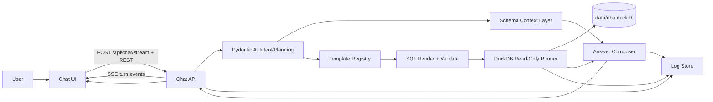

# Basketball Data Chatbot — Implementation Plan

> **Status:** This is the single source of truth for the chatbot project. It supersedes and replaces the former `chat/ARCHITECTURE.md` (the architecture interview document, now deleted). Product and architecture decisions recorded here are **authoritative**; the development plan below fills in the section that the interview explicitly deferred.
>
> **Living document.** Update it as decisions change. When code and doc disagree after a deliberate change, fix the doc in the same PR.

---

## 1. Goal & Scope

Build a chatbot in `chat/` that answers NBA data questions against the local DuckDB warehouse at `data/nba.duckdb`.

- The warehouse is the **only source of truth for data**. Answers come from query results, never from model memory.
- The DB is opened **read-only**.
- v1 ships a **local web chat** (no auth), answers all 20 benchmark questions (some as transparent not-answerable-with-evidence), uses **predefined SQL templates only** (no generated SQL), and creates **no** new warehouse tables/views.
- `chat/` is **fully isolated** from the root/web package tooling.

---

## 2. Product Decisions (authoritative)

| Decision | Choice |
| --- | --- |
| First interface | Local web chat |
| Frontend | Vite + React + TypeScript, separate app under `chat/frontend/`, live reload/HMR |
| Streaming transport | Server-Sent Events |
| API contract | Hybrid REST + SSE |
| Model provider | OpenRouter |
| Model id | Deferred until after build, before live testing (env: `OPENROUTER_MODEL`) |
| Query approach | Predefined/templated SQL only |
| Benchmark scope | All 20 benchmark questions are day-one v1 targets |
| Warehouse scope | Existing tables only; no new helper tables/views in v1 |
| Source-backed templates | Allowed when canonical marts lack a metric (esp. BBR per-100 / advanced / pace) |
| Result table visibility | Default-visible |
| SQL visibility | Collapsible panel |
| Reasoning visibility | Collapsible reasoning-summary/execution-plan panel; **never** private chain-of-thought |
| Citations | Inline chips + dedicated evidence block, every answer |
| Charts | None in v1 |
| Debug persistence | Organized, readable on-disk logs |
| Visible history persistence | Separate from debug logs; server-side sessions in v1 |
| Heavy query behavior | Run live; 300-second timeout; visible running state |
| Project isolation | `chat/` is fully isolated |
| Implementation language | Python |
| Agent framework | Pydantic AI for typed intent/params/answer composition |
| LangGraph | Deferred upgrade path |
| Stack priority | Clean long-term extensibility over fastest prototype |
| Authentication | None; local-only v1 |
| Latency targets | Simple 1–5 s · Medium 5–20 s · Heavy 20–120 s |
| Log retention | 7 rolling days |
| Clear history | Manual "clear visible chat history" control |
| Visible session storage | `chat/data/sessions/` |
| UI shell | Custom React + Tailwind + shadcn + TanStack primitives (we own a11y + streaming state) |
| Result/evidence table | TanStack Table + TanStack Virtual (Perspective deferred to v2) |
| Template/SQL safety | `.sql` files + Python metadata + Pydantic schemas + SQLGlot validation + SQLFluff lint |
| Observability | File-first JSONL + optional OpenTelemetry span hooks |
| Python tooling | `uv` |
| Type sharing | OpenAPI-generated REST client + Pydantic SSE event union with a CI drift guard |

---

## 3. Architecture Decisions (authoritative)

1. **UI shell** — Custom React + Tailwind + shadcn + TanStack primitives. We own accessibility, evidence layout, and SSE state.
2. **Result/evidence table** — TanStack Table + TanStack Virtual. Perspective / AG Grid / Glide deferred.
3. **Template registry & SQL safety** — `.sql` + Python metadata + Pydantic schemas, with a SQLGlot validation pass after rendering (non-`SELECT` rejection + per-template table allowlist) and SQLFluff lint as a quality gate. `aiosql` and lineage checks not adopted.
4. **Type sharing** — `openapi-typescript` + `openapi-fetch` for typed REST; SSE payloads as a Pydantic discriminated union with a CI drift guard (export JSON Schema and `git diff --exit-code`). Handwritten TS types only as a spike stopgap.
5. **Observability** — File-first JSONL baseline + optional OTel span hooks. Logfire/Langfuse/Phoenix deferred.
6. **Python tooling** — `uv` for env/deps/lockfile.
7. **Quality gates** — `ruff` (lint+format), `ty` (type check), `pytest` + `pytest-asyncio` + `pytest-cov`, `sqlfluff`, `deptry`, frontend `tsc`, `vitest`, Playwright smoke, axe-core a11y smoke, `check-jsonschema` on JSONL logs. Git hooks via lefthook (repo convention).

---

## 4. System Architecture

### 4.1 Components

1. **Chat UI** — `chat/frontend/`. Vite + React + TS + Tailwind + shadcn. Chat timeline, default-visible result tables, collapsible SQL and reasoning panels, inline citations + evidence block, manual clear-history.
2. **Chat API** — `chat/server/`. FastAPI. REST for sessions/history/debug/health/config; SSE for active turns. Streams turn events to the UI. Persists structured logs.
3. **Intent & Planning Layer** — Pydantic AI agent with typed output. Classifies intent, picks a template, extracts typed parameters, or asks a clarifying question. Never emits SQL.
4. **Schema Context Layer** — Compact trusted schema map (marts/dims/selected facts + metric defs + known gaps + table fate) fed to the agent as context.
5. **Template Registry** — Named `.sql` + Python metadata pairs grouped by analytical capability. Owns parameter schemas, table allowlists, result schemas, answer policies, examples, fixture tests.
6. **SQL Rendering & Validation Layer** — Renders SQL only from templates, validates parameter types/enums, runs SQLGlot validation (SELECT-only + allowlist), rejects multi-statement/DDL/PRAGMA/ATTACH/COPY, applies default row limits.
7. **DuckDB Query Runner** — Single read-only connection pool, async via thread offload. JSON-safe result conversion. Captures SQL, duration, columns, row count, errors.
8. **Answer Composer** — Pydantic response models. Converts results into concise grounded answers, attaches caveats from `meta_known_gap`, cites tables/metrics/caveats, emits SQL + reasoning payloads. Returns transparent not-answerable-with-evidence when the warehouse can't support an exact answer.
9. **Observability & Log Store** — JSONL session/query/model logs under `chat/data/` + `chat/logs/`. 7-day rolling retention. Redacts `OPENROUTER_API_KEY` and other secrets.

### 4.2 Data flow



---

## 5. Technology Stack (pinned versions)

Reconciled from current docs (2025/2026) across the four recon lanes. Pin these in `pyproject.toml` and `chat/frontend/package.json`.

### 5.1 Backend (Python)

| Package | Pin | Notes |
| --- | --- | --- |
| Python | `>=3.12,<3.14` | 3.13 confirmed; pin to avoid breakage |
| `fastapi` | `>=0.135,<1.0` | Built-in `fastapi.sse.EventSourceResponse` (no `sse-starlette` needed) |
| `uvicorn[standard]` | `>=0.34` | `uvloop` + `httptools` |
| `pydantic` | `>=2.10,<3.0` | Discriminated unions, `TypeAdapter.json_schema()` |
| `pydantic-ai-slim[openrouter]` | `>=2.5,<3.0` | **V2 API.** Slim install pulls only OpenRouter provider |
| `duckdb` | `>=1.2,<2.0` | LTS line; current stable 1.5.x |
| `sqlglot` | `>=25,<26` | DuckDB dialect; full `$name` placeholder support |
| `sqlfluff` | `>=3.2,<4.0` | DuckDB dialect; placeholder templater |
| `httpx` | `>=0.28` | Internal HTTP; Pydantic AI uses it too |
| `loggingredactor` | `>=0.0.7` | `sk-or-…` redaction via `logging.Filter` |
| **dev** `ruff` | `>=0.9` | Lint + format |
| **dev** `ty` | latest | Type check (Astral; matches architecture decision #7) |
| **dev** `pytest` / `pytest-asyncio` / `pytest-cov` | latest | Async test client + coverage |
| **dev** `deptry` | `>=0.20` | Unused/missing dep detection |
| **dev** `check-jsonschema` | latest | Validate JSONL logs/events against exported Pydantic schemas |

> **Pydantic AI V2 migration notes (do not copy pre-June-2026 tutorials):**
> - `result_type` → **`output_type`**, `result_retries` → **`output_retries`**, `result_validator` **removed**.
> - `result.stream()` → **`stream_output()`**; `result.stream_structured()` → `stream_response()`; `result.usage()` method → `result.usage` property.
> - `OpenAIModel` split into `OpenAIChatModel` / `OpenAIResponsesModel`. For OpenRouter, use the native **`OpenRouterModel` + `OpenRouterProvider`** (handles `HTTP-Referer` / `X-Title` and structured-output mapping) — not `OpenAIModel` with a custom base_url.

### 5.2 Frontend (Node)

| Package | Pin | Notes |
| --- | --- | --- |
| Node | `>=20.19` | Vite 6 requirement |
| `vite` | `^6` | Rolldown production build |
| `react` / `react-dom` | `^19` | New shadcn preset drops `forwardRef`; uses `data-slot` |
| `typescript` | `~5.7` | `strict: true`; 3-file tsconfig split |
| `tailwindcss` | `^4` | CSS-first config (`@theme inline`, OKLCH). Replaces `tailwind.config.js`; `tw-animate-css` replaces `tailwindcss-animate` |
| shadcn/ui | latest (CLI, commit-locked) | **New projects use Base UI primitives, not Radix.** `new-york` style default |
| `@tanstack/react-table` | `^8` | Headless table |
| `@tanstack/react-virtual` | `^3` | Virtualized rows |
| `highlight.js` | latest | SQL highlighting (lighter than Shiki; ~25 KB with only SQL registered) |
| `openapi-typescript` | `^7` | Types-only REST codegen |
| `openapi-fetch` | `^0.10` | Typed fetch client, 6 kB, zero runtime |
| `eslint` | `^9` | Flat config |
| `prettier` | `^3` | Match repo root config |
| `vitest` | `^3` | Vite-native test runner |
| `@playwright/test` | `^1.51` | Smoke + e2e |
| `@axe-core/playwright` | `^4` | a11y smoke |

---

## 6. Project Layout

```text
chat/
├── PLAN.md                          # this file (single source of truth)
├── pyproject.toml                   # uv project, backend deps + dev group
├── uv.lock
├── .env.example                     # OPENROUTER_API_KEY, OPENROUTER_MODEL, DUCKDB_PATH, CHAT_LOG_DIR
├── lefthook.yml                     # chat/ pre-commit hooks (or root extension)
├── README.md                        # how to run (after v1 ships)
├── .gitignore                       # data/, logs/, .venv/, frontend/node_modules/, frontend/dist/
│
├── chat_server/                     # Python package (FastAPI app)
│   ├── __init__.py
│   ├── main.py                      # FastAPI app, lifespan, route registration
│   ├── config.py                    # env vars + settings (pydantic-settings)
│   ├── db.py                        # DuckDBSingleton: read-only pool + async execute + JSON converter
│   ├── json_safe.py                 # Decimal/datetime/list/struct → JSON-safe
│   ├── logging_setup.py             # JSONL handlers, 7-day rolling, secret redaction
│   ├── sessions.py                  # JSONL session store under chat/data/sessions/
│   ├── routes/
│   │   ├── __init__.py
│   │   ├── sessions.py              # POST/GET/DELETE /api/sessions, /history, /debug/artifacts/{id}
│   │   ├── chat.py                  # POST /api/chat/stream (SSE) + POST /api/chat (non-streaming)
│   │   └── meta.py                  # GET /api/health, /api/config, GET /openapi.json passthrough
│   ├── events.py                    # Pydantic discriminated SSE event union + JSON Schema export
│   ├── agent.py                     # Pydantic AI Agent (singleton), OpenRouterModel, template tools
│   ├── schema_context.py            # builds the compact trusted schema map for the agent
│   ├── composer.py                  # results → answer + citations + reasoning + not-answerable paths
│   ├── pipeline.py                  # turn orchestration: classify → render → validate → run → compose → emit
│   ├── validation.py                # validate_template_sql() via SQLGlot
│   └── templates/                   # template registry (file pairs)
│       ├── __init__.py              # registry loader (scans *.sql + *.py)
│       ├── _registry.py             # Template dataclass, registry dict, lookup helpers
│       ├── season_thresholds/
│       │   ├── fifty_forty_ninety.sql
│       │   ├── fifty_forty_ninety.py
│       │   └── ...
│       ├── player_game_conditional/
│       ├── career_demographic/
│       ├── season_comparison/
│       ├── team_coach/
│       ├── teammate_overlap/
│       ├── shot_zones/
│       ├── pbp_aggregate/
│       ├── clutch_terminal/
│       └── lineup_court/
│
├── chat_tests/                      # pytest suite
│   ├── conftest.py                  # read-only DB fixture, template registry fixture
│   ├── test_validation.py           # SQLGlot allowlist / SELECT-only / multi-statement rejection
│   ├── test_templates.py            # one parametrized test per template against the live warehouse
│   ├── test_agent.py                # intent classification + param extraction fixtures
│   ├── test_events.py               # SSE union round-trip + drift snapshot
│   ├── test_json_safe.py
│   └── fixtures/                    # JSON fixtures (mirrors web/test/fixtures pattern)
│
├── scripts/
│   ├── export_sse_schema.py         # writes frontend/src/generated/sse-events.schema.json
│   └── export_openapi.py            # writes frontend/openapi.json from FastAPI app
│
├── frontend/                        # separate Vite + React + TS app
│   ├── package.json
│   ├── vite.config.ts               # proxy /api/* → :8787, SSE-friendly
│   ├── tsconfig.json tsconfig.app.json tsconfig.node.json
│   ├── index.html
│   ├── openapi.json                 # committed snapshot (drift-guarded in CI)
│   └── src/
│       ├── main.tsx
│       ├── App.tsx
│       ├── api/
│       │   ├── client.ts            # openapi-fetch typed client
│       │   └── sse.ts               # POST + fetch/ReadableStream → typed ChatEvent stream
│       ├── generated/
│       │   ├── api.d.ts             # openapi-typescript output (committed)
│       │   ├── sse-events.ts        # handwritten TS discriminated union (drift-guarded)
│       │   └── sse-events.schema.json  # Pydantic-exported schema (drift-guarded)
│       ├── hooks/
│       │   ├── useChatTurn.ts       # consumes SSE stream, reducer state
│       │   └── useSessions.ts
│       ├── components/
│       │   ├── ChatTimeline.tsx
│       │   ├── MessageBubble.tsx
│       │   ├── SqlPanel.tsx         # collapsible + copy + highlight.js
│       │   ├── ReasoningPanel.tsx   # collapsible; never shows CoT
│       │   ├── ResultTable.tsx      # TanStack Table + Virtual, 10k cap, copy-CSV
│       │   ├── EvidenceCard.tsx     # citations grouped; links to meta_* tables
│       │   ├── ClarifyPrompt.tsx
│       │   └── ClearHistoryButton.tsx
│       ├── views/
│       │   └── ChatView.tsx
│       └── styles/
│           └── globals.css          # Tailwind v4 @theme inline + shadcn tokens
│
├── tests/                           # Playwright + a11y
│   └── e2e/chat.smoke.ts
│
├── data/                            # gitignored runtime data
│   └── sessions/                    # one JSONL file per session
│
└── logs/                            # gitignored debug logs (7-day rolling)
    ├── sessions/<date>/<session-id>.jsonl
    ├── queries/<date>/<session-id>/<turn-id>.<template-id>.sql|.result.json
    └── model/<date>/<session-id>.jsonl
```

### 6.1 Port & path conventions

- FastAPI on `:8787` (matches the existing `web/` API port family — distinct process, no conflict).
- Vite dev on `:5173`; `vite.config.ts` proxies `/api/*` to `http://localhost:8787` (SSE-friendly: set `Connection: keep-alive`, no buffering).
- All API paths prefixed `/api/`. FastAPI's `/openapi.json` served at root (used by codegen).

---

## 7. Backend Implementation Plan

### 7.1 Configuration (`config.py`)

Use `pydantic-settings`. Required env vars (the four from the architecture, no more):

```env
OPENROUTER_API_KEY=sk-or-...        # required at runtime for the agent
OPENROUTER_MODEL=anthropic/claude-sonnet-4.6   # chosen before live testing
DUCKDB_PATH=../data/nba.duckdb      # absolute or relative to chat/
CHAT_LOG_DIR=./logs                 # JSONL log root
```

`.env.example` committed; `.env` gitignored. Fail fast on missing `OPENROUTER_API_KEY`/`DUCKDB_PATH` at startup.

### 7.2 DuckDB access layer (`db.py`)

- **One process-wide read-only connection** + a pool of 2–4 `cursor()`s (cursors share the underlying instance, lightweight), guarded by an `asyncio.Lock`.
- All queries run via `asyncio.to_thread()` so the FastAPI event loop never blocks on DuckDB.
- **Concurrency contract (critical):** multiple read-only processes can coexist (chatbot + existing `web/` Express server + CLI reads). But **no read-write connection can coexist with any read-only connection on the same file** — running `data/audit/build_nba.py` requires shutting down both the chat API and the `web/` dev server first. Document this in the chat README and in a startup warning if the file is also locked.
- Result conversion (`json_safe.py`):
  - `datetime`/`date` → ISO 8601 string
  - `timedelta` → total seconds (float)
  - `Decimal` → float (or string where precision matters — per-column policy)
  - `list` / `struct` / `map` → recurse
  - `HUGEINT` values that may exceed `2^53` → cast to `VARCHAR` in SQL where JS precision matters (e.g. career totals), or carry as string
- Parameter binding via DuckDB named params: `$param_name` with a dict. Validate param keys against the template's schema before execute.

```python
# Sketch — see lib-2 report for the full pattern.
class DuckDBSingleton:
    def __init__(self, db_path: str, pool_size: int = 3): ...
    async def execute(self, sql: str, params: dict | None = None) -> QueryResult: ...
    def close(self) -> None: ...
```

`QueryResult` carries `columns`, `rows` (JSON-safe list of dicts), `row_count`, `duration_ms`, `truncated` (bool if a row cap was applied).

### 7.3 Template registry (`chat_server/templates/`)

**File pair per template:**

- `<template_id>.sql` — parameterized SQL using DuckDB `$name` placeholders, with a comment header documenting params. Reads only from allowlisted tables.
- `<template_id>.py` — Python metadata module exposing module-level constants:

```python
# Example: chat_server/templates/season_thresholds/fifty_forty_ninety.py
from pydantic import BaseModel, Field

class Params(BaseModel):
    min_ppg: float = Field(default=25.0, ge=0)
    season_type: str = Field(default="Regular Season")

TEMPLATE_ID = "season_thresholds.fifty_forty_ninety"
TITLE = "50-40-90 seasons with minimum PPG"
DESCRIPTION = "Players who shot >=50% FG, >=40% 3P, >=90% FT in a season."
ALLOWED_TABLES = {"mart_player_season"}
RESULT_SCHEMA = {"player_id": int, "full_name": str, "season_year": str, "fg_pct": float, "fg3_pct": float, "ft_pct": float, "avg_pts": float}
ANSWER_POLICY = "ranked_list"          # how the composer summarizes
DEFAULT_LIMIT = 50
EXAMPLES = [
    "50-40-90 seasons with at least 25 PPG",
    "Who shot 50/40/90 and averaged 25+ points?",
]
TESTS = [
    {"params": {"min_ppg": 25.0}, "expect_min_rows": 1, "expect_contains_player": "Stephen Curry"},
]
```

**Registry loader** (`templates/__init__.py`) scans `*.sql`, pairs each with its sibling `.py`, imports the metadata, runs `validate_template_sql()` on the rendered SQL at startup (fail-fast: a template that doesn't validate is a build error), and registers it under `TEMPLATE_ID`.

Templates are grouped into subfolders by **analytical capability** (the 10 families in §11). Template IDs are dotted (`season_thresholds.fifty_forty_ninety`).

### 7.4 SQL safety stack (`validation.py`)

`validate_template_sql(sql: str, allowed_tables: set[str]) -> ValidationReport`:

1. `sqlglot.parse_one(sql, read="duckdb")` — parse error → reject.
2. Reject `exp.Block` (multi-statement).
3. Reject non-`SELECT` root and any forbidden node types: `Attach, Copy, Create, Delete, Drop, Insert, Update, Merge, Alter*, Call, Pragma, Set*, Load, Install, Export, Vacuum, Checkpoint`.
4. Extract all table refs via `ast.find_all(exp.Table)`; reject any not in the template's `ALLOWED_TABLES`.
5. Return `{valid, errors, tables_referenced}`.

At render time (per request), the runner also: validates bound params against the template's `Params` schema, applies `DEFAULT_LIMIT` if the SQL has no `LIMIT`, re-parses the final SQL as a final defense-in-depth, and writes the rendered SQL to the query log.

**SQLFluff** (`chat/.sqlfluff`): `dialect = duckdb`, `templater = placeholder`, `param_style = dollar` with dummy values for every `$param`. Keep a readable rule subset (keyword casing, literal casing); skip noisy layout rules. Run `sqlfluff lint` in CI and pre-commit; allow `-- noqa` for unavoidable cases.

### 7.5 Pydantic AI agent (`agent.py`)

- **Singleton agent** at module level. Native `OpenRouterModel` + `OpenRouterProvider` (api_key, app_url, app_title, optional `timeout=300.0`).
- `deps_type` carries a `TemplateRegistry` view + `SchemaContext` + DB handle.
- `output_type` is a typed `QueryPlan`:
  ```python
  class QueryPlan(BaseModel):
      template_id: str           # must exist in registry
      params: dict[str, Any]     # validated against the template's Params
      clarification: str | None = None   # set when params are missing/ambiguous
      not_answerable_note: str | None = None  # when no template fits
  ```
- **Tools** (the model picks templates, never writes SQL):
  - `list_templates(capability: str | None) -> list[TemplateSummary]` — id, title, description, examples, param names/types.
  - `get_template_detail(template_id: str) -> TemplateDetail` — full param schema + result schema + answer policy.
  - `lookup_player(name: str) -> list[PlayerHit]` — resolves a free-text name to `player_id`s via `dim_player` (so the model doesn't hallucinate ids).
  - `lookup_team(name: str) -> list[TeamHit]`.
  - `lookup_season(phrase: str) -> str` — resolves "2022-2023" / "2022-23" / "last season" to canonical `season_year`.
- `output_retries=3`. Tool bodies may raise `ModelRetry` to feed errors back.
- **Streaming:** `agent.run_stream()` yields partial `QueryPlan`s; `stream_output()` is the typed-output stream. Token-level prose streaming happens later in the composer (separate model call that drafts the answer from the query result).

> **Known risk (pydantic-ai#822):** some OpenRouter models return plain text when asked for structured output. Mitigations: pin `output_retries>=2`, prefer known-reliable models (Claude Sonnet 4.6, GPT-4o), consider `:exacto` variants. Track in v1 spike.

### 7.6 Schema context layer (`schema_context.py`)

Compact, trusted map the agent receives as system-prompt context (rebuilt at startup, cached):

- Allowed tables: `mart_*` (9 tables), `dim_player/dim_team/dim_team_era/dim_game/dim_official/dim_arena/dim_date`, selected `fact_*` (`fact_player_game_box`, `fact_player_game_advanced`, `fact_game_result`, `fact_pbp_event`, `fact_shot`, `fact_standings`, `fact_award`, `fact_draft`, `fact_coach_season`, `fact_official_assignment`), plus allowlisted BBR source tables (`src_bref_advanced`, `src_bref_per_100_poss`, `src_bref_team_summaries`, etc.) reachable only via source-backed templates.
- Per-table: one-line purpose + key columns + grain. Built by querying `information_schema.columns` at startup.
- Metric definitions from `meta_metric_definition` (`metric_key`, `grain`, `expression`, `source_priority`, `notes`).
- Known gaps from `meta_known_gap` (`gap_key`, `severity`, `affected_area`, `status`, `details`, `recommended_action`) — only `status NOT IN ('resolved')` surfaced as caveats.
- Table fate from `meta_table_fate` — `legacy_do_not_use`, `duplicate_superseded`, `empty_endpoint_shell` excluded from the agent's view entirely unless the template explicitly documents using one (rare; only for explaining warehouse state).

### 7.7 Turn pipeline (`pipeline.py`)

For each chat turn (one SSE stream):

1. `turn_started` — emit session_id, turn_id, timestamp.
2. Run the agent → `QueryPlan` (stream `intent_classified` when the model commits to a template, or `clarification_needed`).
3. If clarification → emit `clarification_needed` and end turn.
4. If no template fits → compose a not-answerable response, emit `answer_finished`, end.
5. Render + validate SQL (§7.4). Emit `query_started` with rendered SQL.
6. Execute via `DuckDBSingleton.execute()` with the template's timeout (default 30s; heavy templates set 300s). Emit `query_finished` with duration, row_count, columns.
7. If rows → emit `table_ready` (columns, rows, row_count, truncated). Cap preview at e.g. 200 rows in the SSE payload; full result stays in the debug artifact for lazy fetch.
8. Emit `reasoning` (summary + execution_plan, derived from the agent's plan — **not** model CoT).
9. Compose the answer (separate, smaller model call or templated) → stream `answer_delta` chunks → `answer_finished`.
10. Emit `citation` events (one per cited table/metric/gap).
11. On any exception → `error` event with code + message (redacted).
12. Persist: session JSONL (visible messages), query log (rendered SQL + result preview), model log (redacted request/response).

### 7.8 SSE event union (`events.py`)

Canonical 11-event discriminated union. Extends the architecture's 9 with `reasoning` and `citation`, which the UX requirements (collapsible reasoning panel, inline + evidence-block citations) implicitly require.

```python
class TurnStarted(BaseModel):
    event: Literal["turn_started"] = "turn_started"
    session_id: str; turn_id: str; ts: datetime

class IntentClassified(BaseModel):
    event: Literal["intent_classified"] = "intent_classified"
    template_id: str; confidence: float

class ClarificationNeeded(BaseModel):
    event: Literal["clarification_needed"] = "clarification_needed"
    question: str; options: list[str] | None = None

class QueryStarted(BaseModel):
    event: Literal["query_started"] = "query_started"
    query_id: str; template_id: str; sql: str

class QueryFinished(BaseModel):
    event: Literal["query_finished"] = "query_finished"
    query_id: str; duration_ms: int; row_count: int; columns: list[str]; truncated: bool

class TableReady(BaseModel):
    event: Literal["table_ready"] = "table_ready"
    columns: list[ColumnSpec]; rows: list[dict[str, Any]]; row_count: int; truncated: bool

class Reasoning(BaseModel):
    event: Literal["reasoning"] = "reasoning"
    summary: str; execution_plan: str | None = None

class Citation(BaseModel):
    event: Literal["citation"] = "citation"
    table_name: str | None = None
    metric_key: str | None = None
    gap_key: str | None = None

class AnswerDelta(BaseModel):
    event: Literal["answer_delta"] = "answer_delta"
    delta: str

class AnswerFinished(BaseModel):
    event: Literal["answer_finished"] = "answer_finished"
    answer: str

class ChatError(BaseModel):
    event: Literal["error"] = "error"
    code: str; message: str

ChatEvent = Annotated[Union[...], Field(discriminator="event")]
```

> **Add/remove events here = also update:** (a) `scripts/export_sse_schema.py`, (b) `frontend/src/generated/sse-events.ts`, (c) the frontend reducer, (d) the JSONL log schema. The CI drift guard catches (a) and (b).

### 7.9 REST surface (`routes/`)

| Method | Path | Purpose |
| --- | --- | --- |
| `POST` | `/api/sessions` | Create session `{title}` → `{id, title, status, created_at}` |
| `GET` | `/api/sessions/{id}` | Get session metadata |
| `GET` | `/api/sessions/{id}/history?limit&offset` | Paginated visible messages |
| `DELETE` | `/api/sessions/{id}` | Clear visible history (manual clear) |
| `GET` | `/api/debug/artifacts/{id}` | Fetch a query/model debug artifact by id |
| `GET` | `/api/health` | `{status, db: "connected"}` |
| `GET` | `/api/config` | Non-secret config (`OPENROUTER_MODEL`, latency tier config) |
| `POST` | `/api/chat/stream` | SSE turn (canonical) |
| `POST` | `/api/chat` | Non-streaming turn (returns the final answer object; for tests) |

All request/response models are Pydantic-typed → FastAPI emits `/openapi.json` for free.

### 7.10 Sessions & logs

- **Visible sessions:** `chat/data/sessions/<session_id>.jsonl`, one line per visible message (`{role, content, ts}`). Append-only. `DELETE /api/sessions/{id}` truncates the file (clear visible history).
- **Debug logs:** `chat/logs/{sessions,queries,model}/<date>/...` (see §6 layout). 7-day rolling retention via a startup sweep.
- **Redaction:** `loggingredactor.CommonPIIRedactingFilter` with an added `sk-or-…` pattern. Applied to the root logger at startup. Additionally scrub any captured model request/response payloads before writing the model log.
- **Never logged:** `OPENROUTER_API_KEY`, full model CoT (only the visible reasoning summary), raw user PII beyond the message text.

---

## 8. Frontend Implementation Plan

### 8.1 Bootstrap

`npm create vite@latest frontend -- --template react-ts` → upgrade to React 19, TS ~5.7, Vite 6. Add Tailwind v4 (CSS-first, `@theme inline`, OKLCH tokens), shadcn CLI (`new-york`, Base UI primitives), `@/` alias, `components.json`.

`vite.config.ts`:

```ts
server: {
  port: 5173,
  proxy: {
    "/api": {
      target: "http://localhost:8787",
      changeOrigin: true,
      configure: (proxy) => proxy.on("proxyReq", (req) => {
        if (req.path.includes("/chat/stream")) req.setHeader("Connection", "keep-alive");
      }),
    },
  },
}
```

### 8.2 SSE transport — **POST + fetch/ReadableStream** (canonical)

Chat turns are POSTs with a body, so `EventSource` (GET-only) is the wrong fit and would put prompts in URLs/server logs. The SSE client is a typed async generator over a `fetch` ReadableStream that parses `event:` / `data:` frames and yields `ChatEvent`:

```ts
// frontend/src/api/sse.ts
export async function* streamChat(sessionId: string, message: string): AsyncGenerator<ChatEvent> {
  const res = await fetch("/api/chat/stream", {
    method: "POST",
    headers: { "Content-Type": "application/json" },
    body: JSON.stringify({ session_id: sessionId, message }),
  });
  if (!res.ok) throw new Error(`HTTP ${res.status}`);
  // ... read res.body, split on blank lines, parse event/data, yield typed ChatEvent
}
```

`useChatTurn(sessionId, message)` wraps this in a `useReducer` that accumulates `answer`, `tables`, `citations`, `reasoning`, status, and exposes `cancel()` (AbortController). React 19 StrictMode double-invokes effects in dev — ensure the effect cleanup aborts the in-flight fetch.

### 8.3 Components

- **`ChatTimeline`** — message list with auto-scroll; user/assistant styling; aria-live polite region for streaming deltas.
- **`MessageBubble`** — renders `answer` + inline citation chips (`[mart_player_season]`) that scroll/highlight the evidence block.
- **`SqlPanel`** — shadcn Collapsible; renders SQL with `highlight.js` (SQL grammar only); copy-to-clipboard.
- **`ReasoningPanel`** — shadcn Collapsible; shows `reasoning.summary` + optional `execution_plan`. **Never** renders model CoT (the backend simply doesn't send it).
- **`ResultTable`** — TanStack Table v8 + TanStack Virtual v3; columns built from `TableReady.columns`; sortable; cap render at 10,000 rows; copy-CSV/TSV; row count + truncation indicator.
- **`EvidenceCard`** — groups `Citation` events; links `metric_key` → `/api/admin/tables/meta_metric_definition`-style lookup and `gap_key` → `meta_known_gap` (reuse the existing `web/` admin browser pattern if convenient, or a local equivalent).
- **`ClarifyPrompt`** — renders `clarification_needed` as selectable options + free-text.
- **`ClearHistoryButton`** — `DELETE /api/sessions/{id}` then resets local state.

### 8.4 a11y & smoke tests

- axe-core via `@axe-core/playwright`: zero violations on the chat shell.
- Keyboard: collapsibles, tabs, result table navigation, send-message (Enter to send, Shift+Enter newline).
- `aria-live="polite"` on the streaming answer region; `aria-busy` on the timeline during a turn.

---

## 9. Type Sharing & Drift Guards

### 9.1 REST

- `openapi-typescript http://localhost:8787/openapi.json -o src/generated/api.d.ts` (dev) and `openapi-typescript ./openapi.json -o src/generated/api.d.ts` (CI against the committed snapshot).
- `openapi-fetch` typed client:
  ```ts
  const client = createClient<paths>({ baseUrl: "/api" });
  const { data } = await client.GET("/sessions/{id}/history", { params: { path: { id }, query: { limit: 50 } } });
  ```
- **Drift guard:** CI runs `python scripts/export_openapi.py` (dumps `app.openapi()` to `frontend/openapi.json`) and `git diff --exit-code frontend/openapi.json`.

### 9.2 SSE

- Pydantic union → `scripts/export_sse_schema.py` writes `frontend/src/generated/sse-events.schema.json`.
- Hand-maintained `frontend/src/generated/sse-events.ts` discriminated union mirrors the 11 events (9 events is the threshold where hand-maintaining beats codegen; 11 still fits).
- **Drift guards (CI):**
  1. Regenerate `sse-events.schema.json`; `git diff --exit-code`.
  2. `check-jsonschema` validates a corpus of sample JSONL log/event fixtures against the exported schema.
  3. A vitest snapshot test reads the schema and asserts the TS union keys match.

### 9.3 What FastAPI can't describe

FastAPI's `/openapi.json` can't describe SSE event shapes. Don't fight it — the Pydantic union + drift guards are the SSE contract; OpenAPI covers REST.

---

## 10. Query Template Strategy

- The bot answers via a **growing registry of named templates**. Each defines `id`, `description`, `Params` (Pydantic), `ALLOWED_TABLES`, `sql` (`$name` placeholders), `RESULT_SCHEMA`, `ANSWER_POLICY`, `EXAMPLES`, `TESTS`.
- Out-of-registry questions: (1) try the closest template, (2) ask a clarifying question if params are missing, (3) return a transparent not-answerable-with-evidence response with the attempted SQL if no template fits. **Never** fall back to generated SQL.
- Each benchmark question maps to exactly one template (see §12). If the warehouse can't support an exact answer, the template returns the attempted SQL + an evidence query that proves the missing field / contradiction / unsupported grain.
- Every template has a deterministic pytest fixture against the live warehouse (mirrors the `web/test/fixtures/` pattern; skipped when `data/nba.duckdb` is absent).
- Default row limit per template (`DEFAULT_LIMIT`); heavy PBP templates may cap harder and stream a preview.

---

## 11. Template Families (v1)

Grouped by capability. Complexity = SQL + computational cost, not implementation effort.

| Family | Covers | Complexity | Primary tables |
| --- | --- | :---: | --- |
| `season_thresholds` | 50-40-90, PPG/efficiency thresholds, rookie/final-season slices | Low | `mart_player_season` |
| `career_demographic` | country + 500 GP, career scoring, draft value | Low | `mart_player_career`, `dim_player`, `mart_draft_value` |
| `player_game_conditional` | scoreless assists, win/loss margin splits, triple-/quadruple-doubles, milestone age | Medium | `fact_player_game_box`, `fact_game_result`, `dim_player` |
| `season_comparison` | per-100 player comparison, era pace comparison | Medium | `src_bref_per_100_poss`, `fact_player_game_advanced` |
| `team_coach` | coach + franchise + season intersections, team season advanced | Medium | `fact_coach_season`, `dim_team_era`, `fact_player_game_advanced`, `src_bref_team_summaries` |
| `teammate_overlap` | shared team-season overlap between named players | Medium | `bridge_player_team_season`, `dim_player` |
| `shot_zones` | player shot-zone point distribution | Medium | `fact_shot`, `mart_shot_zones` |
| `pbp_aggregate` | offensive fouls by quarter, scoring runs | High | `fact_pbp_event`, `dim_game` |
| `clutch_terminal` | clutch TS% from PBP, buzzer-beaters | High | `fact_pbp_event`, `fact_player_game_advanced`, `dim_game` |
| `lineup_court` | 5-man shared-court minutes + net rating | High | `bridge_lineup_player`, `fact_player_game_advanced`, `fact_player_game_box` |

### 11.1 Verified warehouse facts that shape the templates

Confirmed by querying `data/nba.duckdb -readonly` during planning (re-verify columns during implementation — schemas evolve):

- **`mart_player_season`** exposes `fg_pct`, `fg3_pct`, `ft_pct`, `avg_pts`, `avg_ts_pct`, `avg_off_rating`, `avg_def_rating`, `avg_net_rating`, `avg_usg_pct`, `avg_pie`. **Does not** expose win shares, per-100, or pace.
- **`fact_player_game_box`** has full box + `plus_minus`, `off_rating`/`def_rating`/`net_rating`, `ts_pct`, `pace`, `is_win`, `is_home`, `opponent_team_id`, `game_date`. Supports conditional splits (Kobe margin split, triple-doubles, quadruple-doubles, scoreless assists, milestone age).
- **`fact_player_game_advanced`** adds `poss`, `pace`, `fta_rate`, ratings — the canonical source for era pace and lineup possession math.
- **`fact_shot`** has `shot_zone_basic` (incl. `'Left Corner 3'`, `'Right Corner 3'`, `'Above the Break 3'`, `'Restricted Area'`, `'Mid-Range'`, `'In The Paint (Non-RA)'`, `'Backcourt'`), `shot_zone_area`, `shot_zone_range`, `loc_x/y`, `shot_made_flag`. Curry corner-3 split is directly feasible.
- **`fact_pbp_event`** (18.7 M rows) has `period`, `clock`, `seconds_elapsed`, `score_home`, `score_away`, `action_type`, `sub_type`, `is_field_goal`, `shot_value`, `shot_result`, `assist_player_id`, `steal_player_id`, `block_player_id`, `foul_drawn_player_id`. Verified foul taxonomy for offensive-foul detection: `Foul|Offensive` (~99 k), `Foul|Offensive Charge` (~15 k), `Turnover|Foul` (~102 k). Scoring-run and buzzer-beater templates derive from this.
- **`fact_draft.organization_type`** has `'High School'` (49 rows) → draft + career-WS template filters here.
- **Win shares / per-100 / pace** are **not** in `mart_player_season`. Source-backed templates must allowlist `src_bref_advanced` (WS/BPM/VORP), `src_bref_per_100_poss`, `src_bref_team_summaries` / `fact_player_game_advanced` (pace). Per architecture, source-backed templates are allowed.
- **Clutch is empty** in canonical metadata: `agg_clutch_stats` and `analytics_clutch_performance` are `empty_endpoint_shell`. Clutch TS% must derive live from `fact_pbp_event` (last 5 min, score within 5). Heavy template.
- **Lineup data exists** (`bridge_lineup_player`, `fact_starting_lineup_player`) but 5-man shared-court net rating needs possession-stitched computation — heaviest template; candidate for a documented not-answerable-with-evidence outcome if v1 spikes prove it too costly.
- **`meta_metric_definition`** columns are `metric_key, grain, expression, source_priority, notes`. **`meta_known_gap`** columns are `gap_key, severity, affected_area, status, details, recommended_action`. Cite `metric_key` and `gap_key` in the `Citation` event.

---

## 12. Benchmark Coverage Matrix

Each of the 20 benchmark questions → template → feasibility → source tables. Feasibility legend: **S**imple (1–5 s), **M**edium (5–20 s), **H**eavy (20–120 s, 300 s timeout), **NA** not-answerable-with-evidence.

### Category 1 — Complex joins

| # | Question | Template | Feasibility | Tables |
| --- | --- | --- | :---: | --- |
| 1 | Top 3 career win shares among HS-drafted players, with drafting teams | `career_demographic.hs_draftee_career_ws` | S | `fact_draft`, `dim_player`, `src_bref_advanced` (source-backed; verify `ws` column) |
| 2 | Seattle SuperSonics final-season head coach + team offensive rating | `team_coach.franchise_final_season_ortg` | M | `dim_team_era`, `fact_coach_season`, `fact_player_game_advanced` (team-season ORtg aggregate) |
| 3 | Active players teammates with both LeBron and CP3 (regular season) | `teammate_overlap.two_player_shared_team_seasons` | M | `bridge_player_team_season`, `dim_player` |
| 4 | Harden 2022-23 PHI vs BKN per-game + team win% after trade | `season_comparison.player_team_split` | **NA** | `mart_player_season` (only PHI rows in 2022-23; trade event not canonical) — emit attempted SQL + evidence query proving the missing BKN rows |

### Category 2 — Advanced aggregations

| # | Question | Template | Feasibility | Tables |
| --- | --- | --- | :---: | --- |
| 5 | 50-40-90 with 25+ PPG | `season_thresholds.fifty_forty_ninety` | S | `mart_player_season` |
| 6 | Kobe FG% in 2009-10 Lakers wins by 10+ vs losses by 10+ | `player_game_conditional.margin_split` | M | `fact_player_game_box`, `fact_game_result`, `dim_team` |
| 7 | Trae vs Luka points per 100 in 2021-22 | `season_comparison.per100_player_compare` | M | `src_bref_per_100_poss` (source-backed), `dim_player` |
| 8 | Highest TS% in 2023 playoff clutch | `clutch_terminal.clutch_ts_leader` | H | `fact_pbp_event` (clutch window), `fact_player_game_advanced` |

### Category 3 — Granular / play-by-play

| # | Question | Template | Feasibility | Tables |
| --- | --- | --- | :---: | --- |
| 9 | Curry left- vs right-corner 3s in 2016-17 | `shot_zones.corner_threes_split` | M | `fact_shot`, `dim_player` |
| 10 | Largest scoring run in a Finals game since 2010 | `pbp_aggregate.largest_scoring_run` | H | `fact_pbp_event`, `dim_game` (`game_type='Finals'`) |
| 11 | 2017-18 Curry/Thompson/Iguodala/Durant/Green lineup net rating + minutes | `lineup_court.fiveman_shared_court` | H (spike) | `bridge_lineup_player`, `fact_player_game_advanced`, `fact_player_game_box` — fall back to NA-with-evidence if possession-stitch cost is too high |
| 12 | Most offensive fouls in 4th quarters, 2022-23 | `pbp_aggregate.fouls_by_period` | H | `fact_pbp_event` (`period=4`, foul taxonomy above) |

### Category 4 — Time-series / longevity

| # | Question | Template | Feasibility | Tables |
| --- | --- | --- | :---: | --- |
| 13 | Youngest triple-double, exact stats + age in days | `player_game_conditional.milestone_age` | M | `fact_player_game_box`, `dim_player.birth_date`, `fact_game_result.game_date` |
| 14 | Most consecutive games with a blocked shot | `player_game_conditional.streak_stat` | M | `fact_player_game_box` (window function; needs missed-game definition) |
| 15 | League avg pace 1998-99 vs 2022-23 | `season_comparison.league_pace_era` | M | `fact_player_game_advanced` (league aggregate) or `src_bref_team_summaries` |
| 16 | Tim Duncan rookie vs final season PTS/RPG per game | `season_thresholds.rookie_vs_final` | S | `mart_player_season`, `dim_player` |

### Category 5 — Edge cases

| # | Question | Template | Feasibility | Tables |
| --- | --- | --- | :---: | --- |
| 17 | Regular-season quadruple-doubles since 1954 | `player_game_conditional.rare_stat_line` | M | `fact_player_game_box` (pts/reb/ast/blk ≥ 10), `fact_game_result` (season_type) |
| 18 | Kobe game-winning buzzer-beaters + opponents | `clutch_terminal.buzzer_beaters` | H (spike) | `fact_pbp_event` (terminal possession, period end, `shot_result='made'`, margin ≤ shot_value), `dim_game` — possibly NA-with-evidence for pre-2000s clock reliability |
| 19 | Most career AST in games where player scored 0 | `player_game_conditional.career_conditional_aggregate` | M | `fact_player_game_box` (pts=0) |
| 20 | Non-USA country with most 500+ GP players + highest scorer from that country | `career_demographic.country_gp_leaders` | S | `dim_player.country`, `mart_player_career.career_gp` |

**Totals:** 6 Simple · 7 Medium · 5 Heavy (2 are spike-gated) · 1 not-answerable-with-evidence, 1 conditional NA. This is the realistic v1 distribution.

---

## 13. Latency & UX Targets

| Tier | Templates | Target | UX |
| --- | --- | --- | --- |
| Simple | `season_thresholds.*`, `career_demographic.*` | 1–5 s | Stream normally; spinner only if > 1 s |
| Medium | `season_comparison.*`, `player_game_conditional.*` (most), `teammate_overlap.*`, `shot_zones.*`, `team_coach.*` | 5–20 s | Visible "running" state; `query_started`/`query_finished` events |
| Heavy | `pbp_aggregate.*`, `clutch_terminal.*`, `lineup_court.*` | 20–120 s (300 s hard timeout) | Visible running state + progress hints + cancel control |

Heavy templates set their timeout to 300 s in the registry metadata; the runner enforces it. The UI shows elapsed time and a cancel button for any turn exceeding 5 s.

---

## 14. Quality Gates

### 14.1 Backend

- `ruff check` + `ruff format` (lint + format)
- `ty` type check
- `pytest` (with `pytest-asyncio`, `pytest-cov`)
- `sqlfluff lint` on template SQL
- `deptry` for unused/missing deps
- `check-jsonschema` on JSONL log/event fixtures against exported Pydantic schemas
- Template-registry smoke test: every registered template passes `validate_template_sql()` at import time (fail-fast).

### 14.2 Frontend

- `tsc --noEmit`
- `eslint .`
- `prettier --check .`
- `vitest run`
- Playwright smoke + `@axe-core/playwright` a11y
- OpenAPI + SSE drift guards (§9)

### 14.3 lefthook (pre-commit)

Extend the root `lefthook.yml` (parallel, `stage_fixed: true` for formatters):

```yaml
chat-py-lint:    { root: chat/, glob: "*.py", run: uv run ruff check --fix {staged_files} }
chat-py-format:  { root: chat/, glob: "*.py", run: uv run ruff format {staged_files} }
chat-py-type:    { root: chat/, glob: "*.py", run: uv run ty {staged_files} }
chat-sqlfluff:   { root: chat/, glob: "*.sql", run: uv run sqlfluff lint --dialect duckdb {staged_files} }
fe-lint:         { root: chat/frontend/, glob: "*.{ts,tsx}", run: npx eslint --fix {staged_files} }
fe-type:         { root: chat/frontend/, glob: "*.{ts,tsx}", run: npx tsc --noEmit }
```

> `ty`/`mypy` on `{staged_files}` only is fast but not cross-file exhaustive; CI runs the full `ty`/`tsc` over the whole package.

### 14.4 CI (`.github/workflows/chat.yml`)

Jobs: backend (lint, type, test, sqlfluff, deptry, jsonschema), frontend (typecheck, lint, format, vitest, playwright, a11y), drift (openapi snapshot + SSE schema snapshot). All must pass on PRs.

---

## 15. Implementation Phases

Each phase has entry criteria (what must already exist) and exit criteria (what "done" means).

### Phase 0 — Scaffolding
**Entry:** nothing. **Exit:** `chat/` package with `pyproject.toml` (uv), `.env.example`, `lefthook.yml`, `chat_server/` skeleton (empty FastAPI app on `:8787` with `/api/health`), `frontend/` skeleton (Vite+React+TS+Tailwind+shadcn) on `:5173` with the `/api` proxy, CI skeleton, `.gitignore` for `data/`, `logs/`, `.venv/`, `node_modules/`, `dist/`. Both servers start; `health` returns `{db:"connected"}` against the real warehouse.

### Phase 1 — Data layer + registry core
**Entry:** Phase 0. **Exit:** `DuckDBSingleton` (read-only pool + async execute + JSON converter with tests), `validate_template_sql()` with full coverage, SQLFluff config, registry loader, and **one** trivial template (`season_thresholds.fifty_forty_ninety`) passing a live-warehouse pytest fixture. No agent yet — a dev CLI runs a template directly with hard-coded params.

### Phase 2 — FastAPI REST + sessions
**Entry:** Phase 1. **Exit:** sessions CRUD (JSONL), history pagination, debug-artifact fetch, `/api/config`, `/openapi.json`. `openapi-typescript` + `openapi-fetch` wired; frontend can create a session and read history with full types.

### Phase 3 — Pydantic AI agent + intent
**Entry:** Phase 2. **Exit:** singleton `Agent` with `OpenRouterModel`, template tools, typed `QueryPlan` output. Non-streaming `POST /api/chat` returns a plan + (for one template) executes it and returns the answer. `lookup_player/team/season` tools wired. Agent pytest fixtures cover intent classification + param extraction for ≥ 5 templates.

### Phase 4 — SSE turn pipeline
**Entry:** Phase 3. **Exit:** `POST /api/chat/stream` emits all 11 `ChatEvent` types end-to-end for the trivial template. SSE union + `export_sse_schema.py` + drift-guard CI in place. Secret redaction on. Logs writing to `chat/logs/`.

### Phase 5 — Frontend chat shell
**Entry:** Phase 4. **Exit:** `ChatTimeline`, `useChatTurn` (POST + fetch/ReadableStream), `SqlPanel`, `ReasoningPanel`, `ResultTable` (TanStack Virtual), `EvidenceCard`, `ClarifyPrompt`, `ClearHistoryButton`. One simple question works end-to-end through the UI. Playwright smoke + axe pass.

### Phase 6 — Template breadth
**Entry:** Phase 5. **Exit:** all 10 families implemented; the 20 benchmark questions answered (Simple/Medium/Heavy distributed per §12). Each template has a live-warehouse fixture. Not-answerable paths produce attempted SQL + evidence. Latency targets measured and met for Simple/Medium; Heavy templates show running state and honor the 300 s timeout.

### Phase 7 — Observability + polish
**Entry:** Phase 6. **Exit:** 7-day log retention sweep, JSONL schemas validated by `check-jsonschema`, optional OTel span hooks (off by default), redaction audit, full a11y pass, error UX (network loss, timeout, model failure), chat README.

### Phase 8 — Hardening
**Entry:** Phase 7. **Exit:** adversarial prompt review (no SQL injection vector, no table outside allowlist ever executed), load test (concurrent turns), not-answerable UX review, model selection live test (pick `OPENROUTER_MODEL`), docs finalised. v1 shippable.

---

## 16. Safety & Correctness Requirements (authoritative, from interview)

- The DB connection is **read-only**. Defense in depth: SQLGlot rejects non-SELECT and enforces per-template allowlists; multi-statement/DDL/PRAGMA/ATTACH/COPY rejected.
- Answers never rely on model memory for stats that can be queried.
- **No generated SQL in v1.** All executed SQL comes from validated templates.
- Prefer canonical marts and derived-rebuild tables; avoid `legacy_do_not_use`, `duplicate_superseded`, `empty_endpoint_shell` tables (except when explaining warehouse state).
- Default result sets are limited; UI caps rendering at 10,000 rows.
- Answers surface uncertainty from data gaps or unavailable tables.
- Rendered SQL and result previews are logged.
- The UI shows a reasoning summary but never private chain-of-thought.
- v1 does not create or mutate warehouse tables, views, or files.
- Logs redact OpenRouter credentials and other secrets.
- Heavy templates run live (no precomputed helpers); 300 s timeout.
- A not-answerable response is valid when backed by attempted SQL and clear evidence.

---

## 17. Open Questions & Spike Items

Resolve during implementation, not now:

1. **WS / BPM / VORP column names** in `src_bref_advanced` (and whether `agg_player_season_advanced` is reliably populated) — verify before writing `career_demographic.hs_draftee_career_ws`.
2. **Pydantic AI + OpenRouter structured-output reliability** for the chosen `OPENROUTER_MODEL` (pydantic-ai#822) — spike in Phase 3; pick a known-reliable model.
3. **Lineup shared-court net rating (Q11)** — spike in Phase 6; decide heavy template vs. not-answerable-with-evidence based on possession-stitch cost.
4. **Buzzer-beater clock reliability (Q18)** — spike on pre-2000s PBP; possibly scope the answer to the shot-clock era where terminal-possession timing is reliable.
5. **Concurrent DB access with the `web/` dev server** — confirmed both can be read-only simultaneously, but verify no file-handle exhaustion on Windows during long dev sessions.
6. **`HUGEINT` JS precision** — decide per-column policy (string-cast career totals, float percentages) during Phase 1.
7. **SSE through reverse proxies** — if a proxy is ever put in front of the local app, ensure `X-Accel-Buffering: no` and proxy timeouts > 15 s ping interval.

---

## 18. Source Index

Authoritative references used to pin the stack (from the four recon lanes):

**Pydantic AI / OpenRouter** — Pydantic AI Agent API https://pydantic.dev/docs/ai/api/pydantic-ai/agent/ · Function Tools https://pydantic.dev/docs/ai/tools-toolsets/tools/ · OpenRouter Model https://pydantic.dev/docs/ai/models/openrouter/ · Output/Streaming https://pydantic.dev/docs/ai/core-concepts/output/ · Chat App with FastAPI https://pydantic.dev/docs/ai/examples/conversational-agents/chat-app/ · Changelog https://pydantic.dev/docs/ai/project/changelog/ · OpenRouter Quickstart https://openrouter.ai/docs/quickstart · Structured Outputs https://openrouter.ai/docs/guides/features/structured-outputs · Rate Limits https://openrouter.ai/docs/api/reference/limits · pydantic-ai#822 https://github.com/pydantic/pydantic-ai/issues/822 · `loggingredactor` https://github.com/armurox/loggingredactor

**DuckDB / SQL safety** — DuckDB concurrency https://duckdb.org/docs/current/connect/concurrency.html · Python DB API https://duckdb.org/docs/lts/clients/python/dbapi.html · Multi-thread guide https://duckdb.org/docs/lts/guides/python/multiple_threads.html · Multi-process discussion https://github.com/duckdb/duckdb/discussions/5946 · SQLGlot https://sqlglot.com/ · AST primer https://github.com/tobymao/sqlglot/blob/main/posts/ast_primer.md · SQLFluff DuckDB dialect https://docs.sqlfluff.com/en/stable/reference/dialects.html#duckdb · SQLFluff placeholder templater https://docs.sqlfluff.com/en/stable/configuration/templating/placeholder.html · `aiosql` (pattern reference) https://github.com/nackjicholson/aiosql

**FastAPI SSE / OpenAPI codegen / drift guard** — FastAPI SSE https://fastapi.tiangolo.com/tutorial/server-sent-events/ · `sse-starlette` https://github.com/sysid/sse-starlette · `openapi-fetch` https://openapi-ts.dev/openapi-fetch/ · `@hey-api/openapi-ts` https://heyapi.dev/docs/openapi/typescript/get-started · Pydantic discriminated unions https://pydantic.dev/docs/validation/latest/concepts/unions/ · JSON Schema https://pydantic.dev/docs/validation/latest/concepts/json_schema/ · lefthook patterns https://github.com/evilmartians/lefthook/discussions/1193

**React UI** — Vite https://vite.dev/guide/ · Vite proxy https://vite.dev/config/server-options.html#server-proxy · shadcn Vite install https://ui.shadcn.com/docs/installation/vite · Tailwind v4 https://ui.shadcn.com/docs/tailwind-v4 · TanStack Table virtualization https://tanstack.com/table/v8/docs/guide/virtualization · TanStack Virtual https://tanstack.com/virtual/v3/docs/introduction · MDN EventSource https://developer.mozilla.org/en-US/docs/Web/API/EventSource · Playwright a11y https://playwright.dev/docs/accessibility-testing · ARIA live regions https://developer.mozilla.org/en-US/docs/Web/Accessibility/ARIA/Guides/Live_regions · `highlight.js` https://highlightjs.org/

---

## 19. Change Log

| Date | Change |
| --- | --- |
| 2026-07-05 | Initial PLAN.md synthesized from the deleted `ARCHITECTURE.md` (interview record) plus four librarian recon lanes (Pydantic AI/OpenRouter, DuckDB/SQLGlot/SQLFluff, FastAPI SSE/OpenAPI codegen, React UI) and live warehouse schema verification. Fills in the Development Plan section the interview explicitly deferred. |
