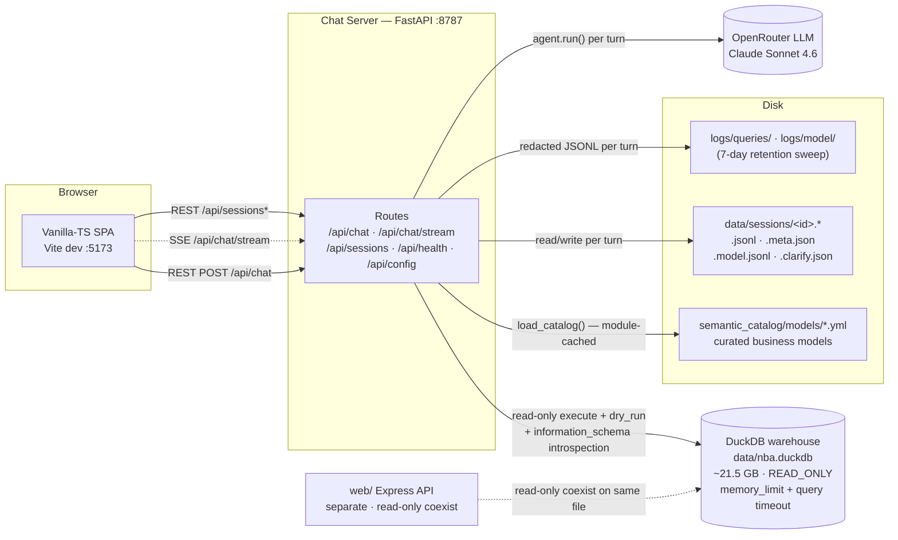
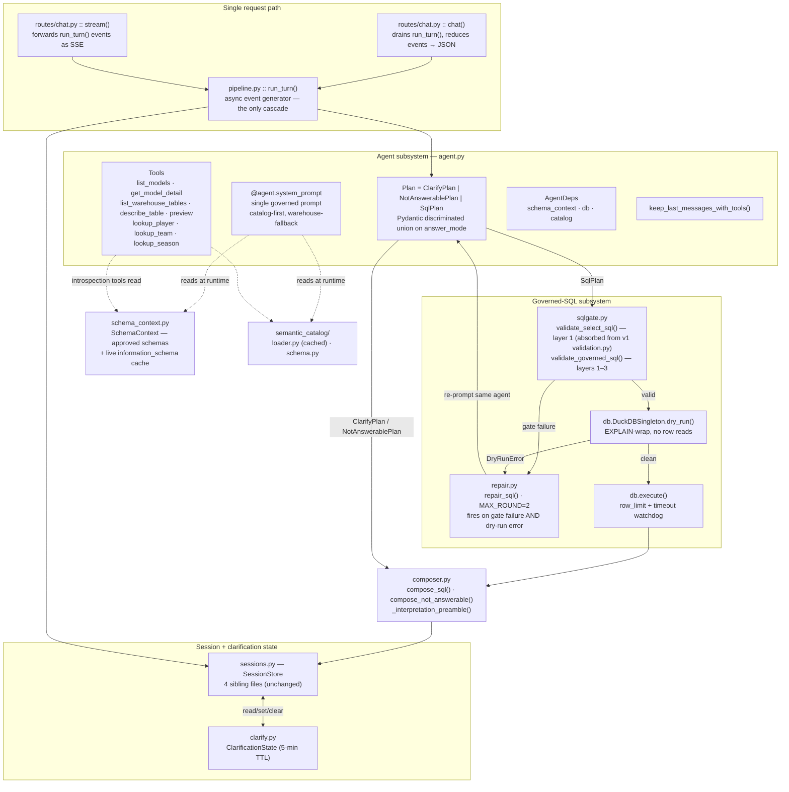
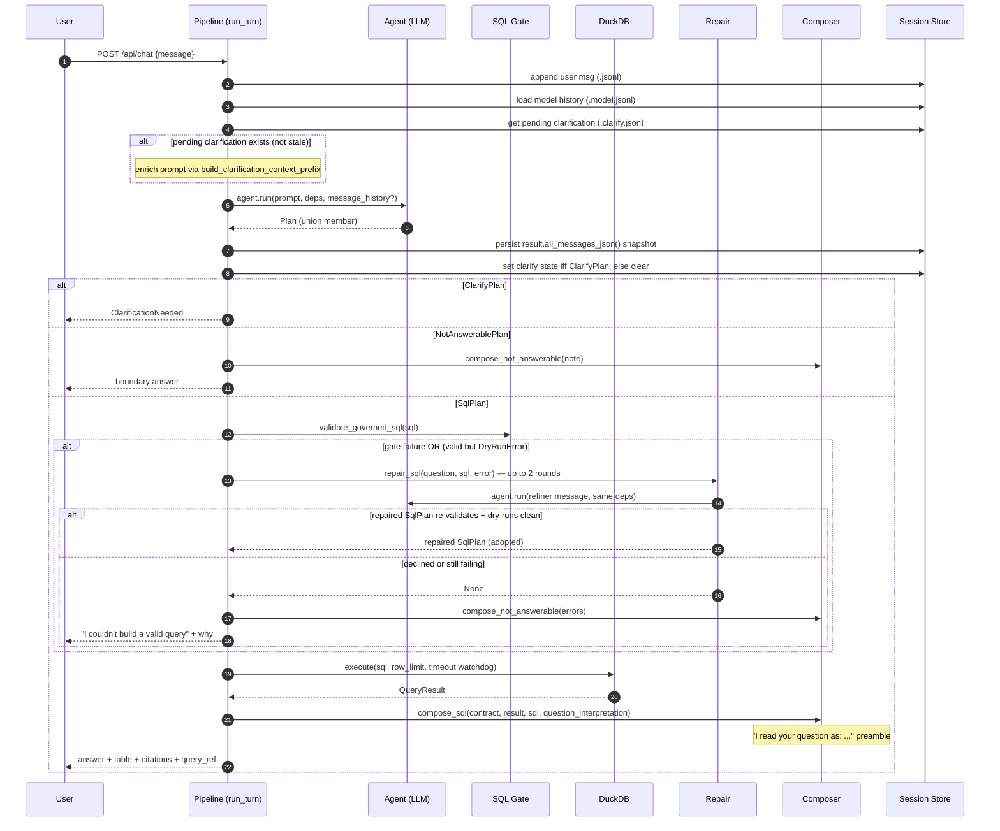

# `chat/` Architecture — v2 (target state)

A governed-SQL NBA analytics chatbot: a Pydantic AI agent that answers questions by writing governed DuckDB `SELECT` SQL — preferring a curated semantic catalog and falling back to live warehouse introspection — with a validate → dry-run → repair loop, multi-turn model-history memory, and cross-turn clarification state. **The legacy template subsystem, the dual-mode flag, and the two-path request duplication from v1 are removed in this version.** §9 is the ordered migration plan from v1.

> **Scope note.** This documents the `chat/` Python server. The `web/` vanilla-TS SPA (port 5173 in dev) is a separate frontend that consumes this server's REST + SSE endpoints; it is shown here only as a boundary.

---

## 0. Goals / non-goals

**Goals.** (1) Answer any NBA question the warehouse can support — coverage is bounded by data, not by a hand-maintained template list. (2) Be transparent about interpretation: every executed answer states how the question was read. (3) Be safe by construction on the read path: read-only connection, SELECT-only gate, bounded resources. (4) Stay debuggable by one person: plain files on disk, one process, one cascade.

**Non-goals.** Multi-user auth and session isolation (single local user; session ids are namespacing, not security). Horizontal scaling or connection pooling. Write access of any kind. Real-time data. Answer-quality guarantees by construction — correctness is asserted by the eval suite (`EVALS.md`), which is a first-class part of this architecture.

---

## 1. Delta from v1

| v1 | v2 | Why |
|---|---|---|
| Dual-mode flag `CHAT_GOVERNED_SQL_MODE`, two system prompts | Deleted; one governed prompt | The flag was a migration crutch; the fallthrough made it a preference, not a gate |
| 16 legacy templates + `TEMPLATE` answer mode | Deleted | Governed SQL subsumes them; evals replace their correctness guarantee |
| `QueryPlan` additive superset, branch order load-bearing | Discriminated union `ClarifyPlan \| NotAnswerablePlan \| SqlPlan` | Illegal states unrepresentable; branch order stops mattering |
| Two request paths duplicating the cascade | One pipeline; JSON route consumes the event stream | One place to change |
| Gate allowlist = catalog tables | Allowlist = approved schemas; layer 2 uses live schema | "Any SQL the warehouse supports" |
| Repair on dry-run errors only, `MAX_ROUND=1` | Repair on gate failures too, `MAX_ROUND=2` | Gate errors are the ones an LLM fixes best; repair is now the only net |
| `template_id` sentinel (`semantic:<table>`) on SSE events | Structured `query_ref {source, tables}` | Honest schema; sentinel debt retired |
| No resource limits | DuckDB `memory_limit` + per-query timeout | The one machine a runaway cross-join can freeze is the operator's |

---

## 2. System Topology



Unchanged from v1: one FastAPI process, one read-only `DuckDBPyConnection`, read-only handles coexist across processes, rebuild tooling requires the server stopped, and the LLM is the only network dependency per turn. New: the connection is opened with a `memory_limit` pragma sized to leave the host usable, and every execute runs under a watchdog that calls `connection.interrupt()` past a wall-clock budget (dry runs are exempt — `EXPLAIN` is cheap). These exist because the gate validates *correctness*, not *cost*: an expensive-but-valid query passes every layer and must be bounded at execution time instead.

---

## 3. Component Architecture



Four groups instead of v1's five: the **agent subsystem** (one prompt, a widened tool surface, the plan union), the **single request path** (`run_turn()` is the implementation; the JSON route is a ~15-line consumer that drains the generator and folds the events into one response — the SSE route forwards them), the **governed-SQL subsystem** (gate, repair, dry-run, guarded execute), and the **state layer** (unchanged). The v1 note "the two request paths deliberately duplicate the branching cascade" is retired: the migration that justified it is over, and the cascade now exists in exactly one function.

---

## 4. Request Flow



The load-bearing details carried over from v1: (a) model history loads before the agent call and persists after, with corrupt history degrading to an empty list; (b) the clarify-state side effect runs in one block above the dispatch, so every non-clarify outcome auto-clears stale state; (c) repair reuses the same agent singleton and `AgentDeps` — only the user-prompt content changes. New in v2: (d) dispatch is a `match` on the plan's type, so there is no ordering contract to document or violate; (e) repair fires on **gate failures as well as dry-run errors** — an unknown-column or fan-trap message is precisely the feedback an LLM repairs well, and with templates gone, repair is the only net (`MAX_ROUND=2`, each round re-runs the full gate + dry-run); (f) when repair is exhausted, the user gets the *reason*, not a bare apology — the gate/dry-run error is summarized in the boundary answer.

---

## 5. Warehouse Access Model (catalog-first hybrid)

The agent sees the warehouse through two surfaces with an explicit preference order, encoded in the system prompt:

**Surface 1 — the semantic catalog (preferred).** The curated business models remain the primary interface: their descriptions, measures, and join declarations are prompt fuel that produces better SQL, and the fan/chasm-trap detector (§ gate layer 3) only works where `one_to_many` declarations exist. The prompt instructs: *use a catalog model whenever one covers the question.*

**Surface 2 — live warehouse introspection (fallback).** Three tools open the long tail: `list_warehouse_tables()` (from `information_schema`, filtered to approved schemas — marts and dims in, raw/staging out), `describe_table(name)`, and `preview(table, n≤5)`. The prompt instructs: *introspect only when the catalog lacks coverage, and always report which tables you used.*

**The gate adapts per layer rather than per surface:**

- **Layer 1 — SQL safety (universal, absorbed from v1 `validation.py` as `validate_select_sql`)**: parse, single statement, SELECT-only, forbidden nodes, CTE-alias checks, dangerous-TVF block. The allowlist changes meaning: *approved schemas* rather than catalog tables.
- **Layer 2 — schema validation (universal, upgraded)**: `sqlglot.optimizer.optimize` now builds its schema from a cached `information_schema` snapshot of the approved schemas, not from the catalog alone — unknown-column and type checks work for fallback queries too. The cache invalidates on process start (the warehouse only changes when rebuilt, which requires the server stopped).
- **Layer 3 — fan/chasm-trap detection (catalog-scoped)**: applies only to joins where both sides carry catalog cardinality metadata; skips otherwise. This is a one-condition change — the detector was already designed to skip ambiguous cases rather than false-positive.

**Coverage gaps are telemetry.** Every executed answer carries `query_ref.source` (`catalog` | `warehouse`). A recurring `warehouse`-sourced question is the promotion signal: write the model YAML, and that question class gets better answers and layer-3 protection from then on. The catalog is an accelerating cache of semantics, not a wall.

---

## 6. Wire Contract

The SSE stream remains the 11-event discriminated union, generated into the TypeScript union consumed by `web/`, with the JSONL replay drift guard unchanged in mechanism. One deliberate break from v1: `IntentClassified` and `QueryStarted` drop the `template_id: str` field (and with it the `semantic:<table>` sentinel) in favor of

```
query_ref: { source: "catalog" | "warehouse", tables: string[] }
```

The TS union is regenerated and the replay guard re-snapshotted once, in the same PR (§9 step 8). This is the honest version of what the sentinel deferred: the namespace-in-a-string encoding existed to avoid schema drift during the migration, and the migration is over.

---

## 7. Session Storage Layer

Unchanged from v1 — four sibling files per session under `data/sessions/`:

| File | Purpose | Failure mode |
|---|---|---|
| `<id>.jsonl` | Visible chat log, append-only, paginated | Survives independently |
| `<id>.meta.json` | id · title · status · counts | Rewritten alongside appends |
| `<id>.model.jsonl` | Full Pydantic AI transcript, atomic overwrite (`.tmp` + `os.replace`) per turn | Corrupt/missing → empty history, turn proceeds |
| `<id>.clarify.json` | At most one pending `ClarificationState`, 5-min TTL | Absent/corrupt/stale all collapse to `None`, never raises |

Model history is trimmed by `keep_last_messages_with_tools` (n=20; backs the cut up rather than orphaning a `ToolReturnPart`). All IO stays best-effort: a failed write logs and returns, the turn always continues. The three stores remain deliberately independent. Known accepted limitation (per §0 non-goals): concurrent turns on the same session id are last-write-wins on `.model.jsonl` — fine for one user, documented so it isn't rediscovered as a bug.

---

## 8. Design annotations

**Why a discriminated union, concretely.** v1's `QueryPlan` superset carried every mode's fields simultaneously and relied on a documented check-order ("branch order is load-bearing") duplicated across two request paths. The union (`Annotated[ClarifyPlan | NotAnswerablePlan | SqlPlan, Discriminator("answer_mode")]`, passed directly as the Pydantic AI `output_type`) makes a plan with both `sql` and `clarification` unrepresentable, turns the cascade into an exhaustive `match`, and lets the fixture suite construct exactly the member it means. The v1 migration constraints that justified the superset (TestModel fixtures emitting bare `{template_id, params}`, the `str | Clarification` union) are retired with it; fixtures are updated in the same PR (§9 step 3).

**Why repair now covers gate failures.** In v1 a gate failure went straight to not-answerable while dry-run errors got a repair round — an accident of layering, not a decision. The asymmetry was tolerable when templates existed as a fallback; in v2, gate messages ("unknown column `pts_per_game`, did you mean `pts_pg`?", "aggregation over fanned join without collapsing GROUP BY") are the highest-value repair inputs the system produces. Two rounds, full re-validation each round, and the final failure message reaches the user with the reason attached.

**Why the timeout lives at execute, not the gate.** The gate answers "is this query well-formed and semantically valid"; `EXPLAIN` answers "will DuckDB accept it"; neither answers "should one query be allowed to take the host down." Cost is a runtime property, so the bound is a runtime mechanism: `memory_limit` pragma at connection open, wall-clock watchdog calling `interrupt()` around `execute()`. A timed-out query composes as a boundary answer suggesting a narrower question.

**Why evals are load-bearing architecture.** Templates guaranteed correctness by construction; nothing in v2 does. The three-layer suite in `EVALS.md` (plan-mode assertions with an over-clarify guard, warehouse-snapshot gold values, optional dialogue judge) is the replacement guarantee, which is why §9 lands it *first* and every subsequent step merges green. The over-clarify guard doubles as the enforcement mechanism for the soft/hard ambiguity split (rules 9–10), which otherwise exists only as prompt text.

**What was deliberately kept.** The soft/hard ambiguity split and the `_interpretation_preamble` ("I read your question as: …") carry over unchanged — with broader SQL freedom, stating the interpretation matters more, not less. The session file layout, TTL self-healing, and best-effort IO carry over verbatim: they were the parts of v1 that were already right.

---

## 9. Migration plan from v1

Ordered so each step lands independently and the eval suite is green at every merge (re-baselined only where noted). Steps 1–2 are pure additions; nothing is deleted until step 7.

1. **Land the eval harness** (`EVALS.md`, `nba_chatbot_evals_v2.csv`): plan-layer assertions against the v1 governed mode, gold values populated for the single-turn rows. Baseline recorded.
2. **Resource limits**: `memory_limit` pragma + execute watchdog. Tiny, independent, protects everything after it.
3. **Plan union**: introduce the three plan classes, switch `output_type`, rewrite the dispatch in *both* v1 paths as a `match`, update fixtures. The `TEMPLATE` mode survives temporarily as a fourth union member so legacy tests still pass.
4. **Unify the paths**: `chat()` becomes a consumer of `run_turn()`. Delete the duplicated cascade. The 11-event replay guard confirms the SSE surface is byte-identical.
5. **Widen repair**: gate failures enter the repair loop, `MAX_ROUND=2`. Watch the eval report's repair-invocation and gold-pass rates.
6. **Hybrid access**: introspection tools, schema-scoped allowlist, live-schema layer 2, catalog-scoped layer 3. Re-pin the coverage-dependent eval rows (EVALS.md §2) against real warehouse coverage.
7. **Delete the legacy subsystem**: `templates/`, the flag, `SYSTEM_PROMPT_TEMPLATE`, template tools, the `TEMPLATE` union member; extract layer-1 checks into `sqlgate.validate_select_sql` and delete `validation.py`. Eval suite is the merge gate.
8. **Break the wire contract once**: `template_id` → `query_ref`, regenerate the TS union, re-snapshot the replay guard, update the SPA. Single PR across both repos' surfaces.

Rollback story after step 7 is git, not an env var — which is the point: the flag existed to make rollback cheap during a migration, and keeping it after the migration is how dual-mode debt becomes permanent.
